# 🚀 KovaScape AI-Ops 智能运营平台 — RPD 文档

> **Requirements & Product Design Document**
> 版本: v1.0 | 日期: 2026-06-06 | 状态: 待评审

---

## 1. 项目概述 / Project Overview

### 1.1 项目愿景与定位 (Vision & Positioning)

**[定位] 组级差异化运营增效平台 (二次提纯与短板补齐)**
本项目**非从零构建**替代公司级的通用系统，而是作为**团队/小组级**的个性化定制平台，旨在与公司正在开发的 AI Agent 和工作流进行深度结合：
- **二次提纯 (Refinement)**：对公司级 AI 系统的输出结果（如广告竞价建议、初步 Listing 文案）进行二次过滤，注入我们组独有的运营逻辑（如 `625广告分析法`）。
- **短板补齐 (Gap Filling)**：填补公司通用系统未覆盖的特异性痛点（如个性化排产决策、特定跟卖及 IEN 自动回填、红人个性化跟进等）。
- **差异化竞争能力定制 (Differentiation)**：将我们组的专属 SOP（如《欧洲站工作SOP》）和成功方法论转化为工具代码，形成本组在市场上的独特竞争优势。

**[中文说明]** 结合公司级 AI/工作流，做输出结果的二次提纯与短板补齐，定制小组特有的差异化竞争工具箱。
**[English Version]** Integrate with corporate AI/workflows to refine outputs, fill functional gaps, and customize a group-level toolkit for differentiated competitive advantage.

### 1.2 项目范围

本平台覆盖 **12 大核心业务模块**：

| # | 模块 | 核心价值 | AI 介入程度 |
|---|------|---------|------------|
| 1 | 店铺全面扫描 | 链接/库存/库龄健康度 | ⭐⭐⭐ 异常检测 |
| 2 | 物流跟踪 | 入库/IEN/库容监控 | ⭐⭐ 自动化回填 |
| 3 | 合规检查 | 跟卖/GPSR/下架申诉 | ⭐⭐⭐ 自动检测+生成 |
| 4 | 财务数据 | 利润/结算/资金看板 | ⭐⭐⭐ 预测+异常 |
| 5 | Listing上架 | 撰写/图文/旗舰店/视频 | ⭐⭐⭐⭐⭐ AI生成 |
| 6 | 广告分析优化 | 数据分析/排名/自动优化 | ⭐⭐⭐⭐ 智能建议 |
| 7 | 站内活动 | 提报/折扣/对比 | ⭐⭐ 辅助分析 |
| 8 | 联盟营销 | Amazon Associates管理 | ⭐⭐ 自动化 |
| 9 | 独立站运营 | DTC站点+SEO | ⭐⭐⭐ AI内容 |
| 10 | 社媒运营 | 内容发布/互动 | ⭐⭐⭐⭐ AI生成+排期 |
| 11 | 红人开发 | 达人发现/邀约/管理 | ⭐⭐⭐ AI匹配 |
| 12 | 产品开发 | 市场调研/痛点/需求 | ⭐⭐⭐⭐ AI洞察 |

### 1.4 与公司系统集成与差异化设计 (Integration & Differentiation Strategy)

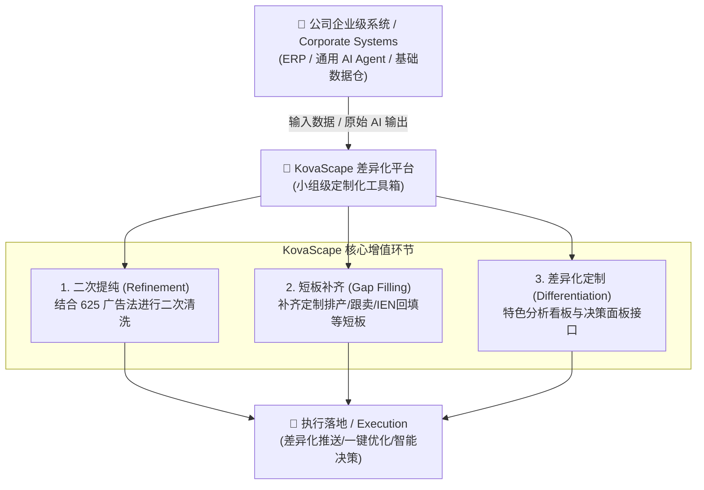

#### 二次提纯与短板补齐映射表：
| 模块名称 | 公司级系统已覆盖 (Upstream) | 我们组的增值提纯/补齐方向 (Our Value-Add) |
|----------|---------------------------|------------------------------------------|
| **#1 店铺全面扫描** | 店铺基础销售/库存报表 | 注入 **625 矩阵**、甘特图断货模拟与红黄绿灯风险模型 |
| **#2 物流跟踪** | 基础海拨在途数量 | **定制排产联动**、多工厂交期校验与箱规检查短板补齐 |
| **#4 财务数据** | 领星 ERP 财务结算单 | 订单级利润**实时归因分摊**、SKU级别 P&L 可视化看板 |
| **#5 Listing上架** | 通用 AI Listing 撰写 | 针对本组品类做**词库精准匹配与 A/B 方案交叉对比** |
| **#6 广告分析优化** | 基础广告数据展示/大盘调价 | **625 矩阵四象限**（吸血词/僵尸词）智能筛选与手动提纯 |
| **#12 产品开发** | 第三方工具大盘分析 | 针对本组品类做 **Review 痛点自动聚类与差异化需求挖掘** |

---

### 1.3 已有资产清单

> [!TIP]
> 以下工具已开发完成，将作为新平台的基础模块直接集成或升级。

| 工具名称 | 文件 | 功能描述 | 对应模块 |
|---------|------|---------|---------|
| KovaScape Ops Hub | `kovascape-hub.html` | 运营工具统一入口，分类管理+iframe嵌入 | 🏗️ 平台框架 |
| 广告综合分析面板 v6.10 | `广告综合分析面板_v6.10.html` | 广告多维度可视化分析、ACOS趋势、关键词表现 | #6 广告分析 |
| 决策面板 v7 | `决策面板-v7.html` | 库存决策/DMS/甘特图/断货预警/排产联动 | #1 店铺扫描 |
| 排产面板 v5 | `排产面板-v5.html` | 排产批次/交期校验/箱规检查/多工厂异常 | #2 物流跟踪 |
| 月报整合器 v4.15 | `月报整合器v4.15.html` | 月度数据整合/多维度报表 | #4 财务数据 |
| 销量分析助手 v2.5 | `销量分析助手v2.5.html` | 销量趋势/SKU表现/异常识别 | #6 广告分析 |
| FBA利润核算器 (US/EU/JP) | `亚马逊FBA利润核算器-*.html` | 多站点FBA利润计算/燃油附加费 | #4 财务数据 |
| 西柚数据对比面板 v1.5 | `西柚数据对比面板_v1.5.html` | 竞品数据对比/市场趋势 | #12 产品开发 |
| Variation批量书写器 v4.0 | `Variation_Batch_Writer__v40.html` | 变体Listing批量生成/多SKU输出 | #5 Listing上架 |
| 变体标题批量生成器 v3.6 | `变体标题批量生成器v3.6.html` | 批量变体标题生成/多尺寸组合 | #5 Listing上架 |
| Amazon Image Tool v5.0 | `Amazon_Image_Tool_V5.0.py` | 亚马逊产品图片批量提取 | #5 Listing上架 |
| Excel列提取 | `Excel列提取.html` | Excel数据列提取工具 | 通用工具 |
| 产品翻单计算器 | `产品翻单计算1.0.html` | 翻单成本/数量计算 | #4 财务数据 |
| 欧洲站工作SOP | `南京欧洲站-Kovascape-工作SOP-v.1.3.html` | 标准操作流程指南 | 通用工具 |
| Dashboard (Streamlit) | `dashboard.py` | 库存预警/ASIN诊断/广告分布 | #1 店铺扫描 |
| Ads Panel | `ads_panel.html` + `ads_panel.js` | 广告面板前端 | #6 广告分析 |
| Keywords Tagger | `amazon-keywords-tagger/` | 关键词标签系统 | #6 广告分析 |
| Applo Blog知识库 | `Applo Blog/` (51篇文章) | 广告投放知识文章库 | #6 广告知识 |
| 品牌方案/AMC报告 | `Report/` 目录 | AMC受众策略/品牌方案/优化报告 | #8 联盟营销 |

---

## 2. 系统架构设计 / System Architecture

### 2.1 整体架构图

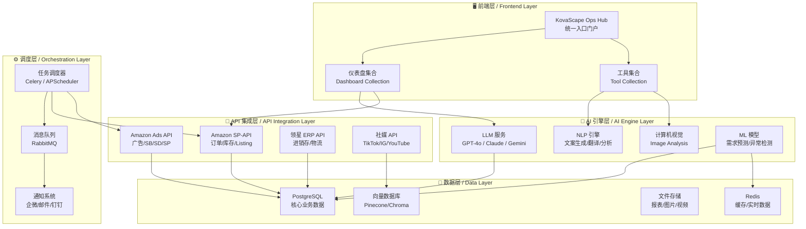

### 2.2 技术选型与数据摄入模式

鉴于无法直接获取公司系统与领星 ERP 的 API 接口，且亚马逊 SP-API 正在申请中，本项目采取**「本地优先、基于文件解析（File-based Ingestion）与 Bulk 批量回传」**的混合架构：

| 层级 | 技术选择 | 落地形态 / 理由 |
|------|---------|-----------------|
| **平台入口** | KovaScape Hub (HTML) | 升级自现有的 `kovascape-hub.html`，通过本地 Python 服务联动 |
| **数据处理引擎** | Pandas (Python) + XLSX.js (JS) | 本地解析领星导出的 CSV/XLSX，以及公司系统的决策与排产数据 |
| **本地服务层** | Python (FastAPI/Streamlit) | 本地运行服务（如 `launcher_service.py`），确保数据资产本地化与安全性 |
| **数据流转模式** | CSV 上传 → 本地提纯可视化 → Bulk表回传 | 读取公司系统导出的预测/决策 CSV，通过面板进行本组策略提纯，生成 Amazon Bulk (批量操作) 表回传后台 |
| **API 接口过渡** | 预留 SP-API 接口模块 | 接口申请通过前，采用手动下载报告解析；通过后，自动切换为 API 异步拉取 |
| **现有工具集成** | iframe 嵌入 / 渐进式组件化 | 零成本保留现有 HTML 优秀工具，部分核心工具（如广告、排产）进行重构升级 |

---

## 3. 模块详细设计 / Module Detailed Design

---

### 🔍 模块 1: 店铺全面扫描

**目标**: 对店铺链接、库存、库龄进行全维度健康检查，自动生成异常报告。

#### 功能需求

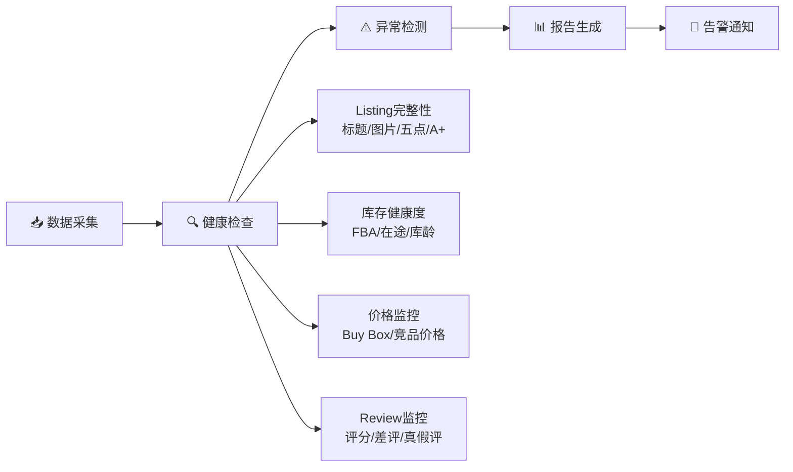

| 子功能 | 描述 | AI 参与 | 数据源 |
|--------|------|---------|--------|
| Listing 完整性扫描 | 检查标题/图片/BP/A+/视频完备率 | GPT分析标题质量 | SP-API |
| 库存水位监控 | FBA现货/在途/库龄分布 | ML预测断货时间 | SP-API + 领星 |
| 库龄分析 | 90/180/270/365天库龄分布+滞销预警 | 异常检测模型 | SP-API |
| Buy Box监控 | 实时Buy Box归属/丢失告警 | 规则引擎 | SP-API |
| Review监控 | 星级/评论数/差评内容分析 | NLP情感分析 | SP-API |
| 竞品价格监控 | 同类目价格带分布 | 统计分析 | SP-API + 爬虫 |

> [!NOTE]
> **已有基础**: [决策面板-v7.html](file:///d:/Zero%20Tools/AI%E5%B7%A5%E5%85%B7/%E5%86%B3%E7%AD%96%E9%9D%A2%E6%9D%BF-v7.html) 已实现库存决策和断货预警功能，可在此基础上扩展 AI 预测能力和 SP-API 自动数据采集。

---

### 📦 模块 2: 物流跟踪

**目标**: 全链路物流可视化，自动化单号回填，库容智能预警。

#### 功能需求

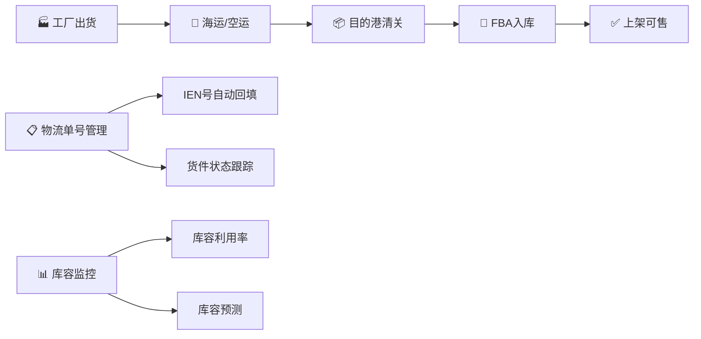

| 子功能 | 描述 | AI 参与 | 数据源 |
|--------|------|---------|--------|
| 物流状态跟踪 | 发货→运输→清关→入库全流程 | 异常延迟预测 | 领星 + 货代API |
| IEN号自动回填 | 扫描入库单自动匹配填入IEN | OCR+规则匹配 | SP-API |
| 物流单号管理 | 集中管理所有shipment的tracking# | 自动关联 | SP-API |
| 库容监控 | 各仓库容利用率实时展示 | 趋势预测 | SP-API FBA |
| 入库异常检测 | 入库数量差异/丢件告警 | 异常检测 | SP-API |

> [!NOTE]
> **已有基础**: [排产面板-v5.html](file:///d:/Zero%20Tools/AI%E5%B7%A5%E5%85%B7/%E6%8E%92%E4%BA%A7%E9%9D%A2%E6%9D%BF-v5.html) 已有排产和出运管理功能。

---

### 🛡️ 模块 3: 合规检查

**目标**: 自动化合规风险检测与处理，保障账号安全。

#### 功能需求

| 子功能 | 描述 | AI 参与 | 优先级 |
|--------|------|---------|--------|
| 跟卖检查 | 定时检测是否被跟卖+自动发警告信 | 规则引擎+模板生成 | 🔴 高 |
| GPSR合规检查 | 欧洲站GPSR法规合规性自动检查 | 文档解析+规则匹配 | 🔴 高 |
| Listing下架监控 | 下架原因分析+申诉模板自动生成 | GPT生成申诉信 | 🔴 高 |
| 知识产权排查 | 潜在侵权风险提前发现 | NLP相似度比对 | 🟡 中 |
| 政策变更监控 | 亚马逊政策变化自动提醒 | 网页监控+摘要 | 🟡 中 |

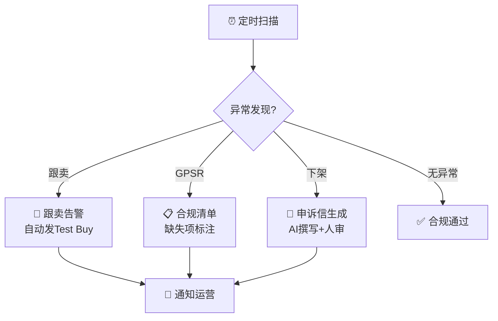

---

### 💰 模块 4: 财务数据

**目标**: 全维度利润核算，资金流可视化，财务健康一目了然。

#### 功能需求

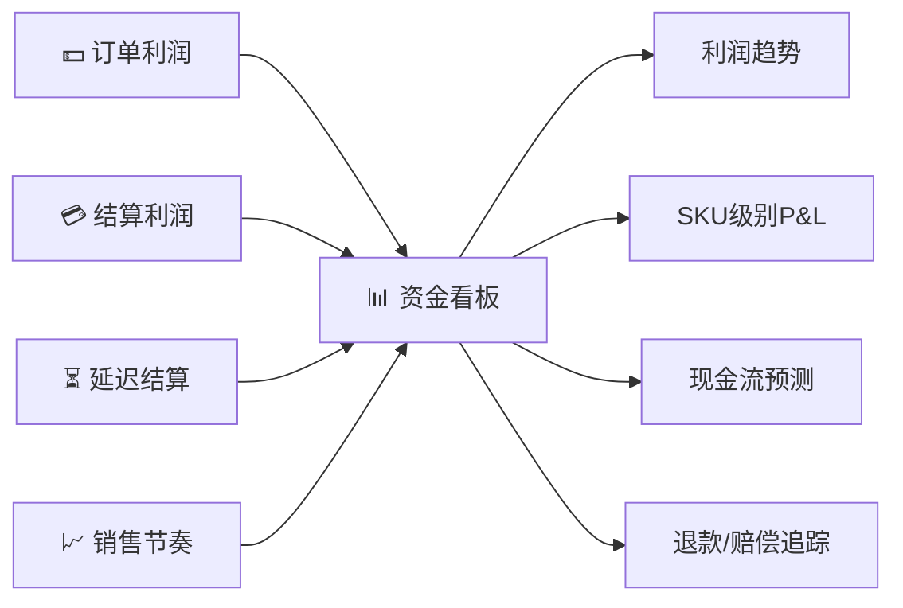

| 子功能 | 描述 | AI 参与 | 数据源 |
|--------|------|---------|--------|
| 订单级利润 | 每单真实利润=售价-成本-FBA费-广告分摊-退货 | 自动归因分摊 | SP-API + 领星 |
| 结算周期分析 | 14天结算/延迟结算追踪 | 异常检测 | SP-API |
| SKU级P&L | 每个SKU的详细损益表 | 自动聚合计算 | 多源合并 |
| 资金看板 | 资金流入/流出/冻结/可用一览 | 趋势预测 | SP-API |
| 销售节奏分析 | 日/周/月销售节奏+同比环比 | AI洞察生成 | SP-API + 领星 |
| 退款追踪 | FBA丢件/损坏赔偿自动申请 | 自动化脚本 | SP-API |

> [!NOTE]
> **已有基础**: 
> - [FBA利润核算器 US/EU/JP](file:///d:/Zero%20Tools/AI%E5%B7%A5%E5%85%B7) — 已有多站点利润计算核心逻辑
> - [月报整合器 v4.15](file:///d:/Zero%20Tools/AI%E5%B7%A5%E5%85%B7/%E6%9C%88%E6%8A%A5%E6%95%B4%E5%90%88%E5%99%A8v4.15.html) — 已有月度数据整合能力
> - [产品翻单计算器](file:///d:/Zero%20Tools/AI%E5%B7%A5%E5%85%B7/%E4%BA%A7%E5%93%81%E7%BF%BB%E5%8D%95%E8%AE%A1%E7%AE%971.0.html) — 翻单成本计算

---

### 📝 模块 5: Listing上架 (AI深度参与)

**目标**: AI驱动的Listing全流程，从撰写到图文设计到旗舰店一站式搞定。

#### 功能需求

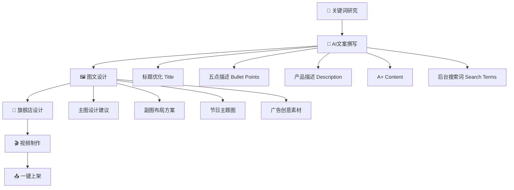

| 子功能 | 描述 | AI 参与 | 优先级 |
|--------|------|---------|--------|
| 关键词研究 | ABA数据+竞品词+长尾词挖掘 | NLP语义扩展 | 🔴 高 |
| AI Listing撰写 | 标题/BP/Description/A+内容 | GPT-4o生成 | 🔴 高 |
| 多语言翻译 | 英→德/法/意/西/日 母语级翻译 | GPT + 本地化审校 | 🔴 高 |
| 图文设计 | 主图/副图/A+模块设计方案 | AI生图+布局建议 | 🟡 中 |
| 节日/广告创意 | 节日主题图+广告创意素材 | AI创意生成 | 🟡 中 |
| 旗舰店设计 | Brand Store页面设计方案 | AI布局建议 | 🟢 低 |
| 视频脚本 | 产品视频脚本撰写+分镜建议 | GPT生成 | 🟢 低 |

> [!NOTE]
> **已有基础**:
> - [Variation批量书写器 v4.0](file:///d:/Zero%20Tools/AI%E5%B7%A5%E5%85%B7/Variation_Batch_Writer__v40.html) — 变体Listing批量生成
> - [变体标题批量生成器 v3.6](file:///d:/Zero%20Tools/AI%E5%B7%A5%E5%85%B7/%E5%8F%98%E4%BD%93%E6%A0%87%E9%A2%98%E6%89%B9%E9%87%8F%E7%94%9F%E6%88%90%E5%99%A8v3.6.html) — 批量标题组合
> - [Amazon Image Tool v5.0](file:///d:/Zero%20Tools/AI%E5%B7%A5%E5%85%B7/Amazon_Image_Tool_V5.0.py) — 图片批量提取

---

### 📊 模块 6: 广告分析审计与提纯 (625 Ad Refinery & Audit)

**目标**: 结合小组 `625 广告分析法` 对广告数据及公司 AI 策略进行**二次审计与偏差核对**，避免多头操作冲突，确保策略精准安全。

#### 🛡️ 冲突防范定位 (Anti-Conflict Strategy)
为避免与公司正在开发的 Ad AI Agent 产生双重调价或重复否词等冲突，本项目采取 **「被动审计与把关过滤器 (Passive Auditor & Filter)」** 定位：
- **不进行自主广告操作**，不在后台并行修改竞价。
- **作为“校验过滤器”**：将公司 Ad AI Agent 推荐的 Bulk 表或策略报告导入本面板，结合我们组的 `625 广告参数` 进行核对，高亮显示不符合 625 规则的“异常出价建议”（如公司 Agent 建议提价，但该词在 625 中被判定为高花费无转化“吸血词”）。
- **人工决定最终放行**。

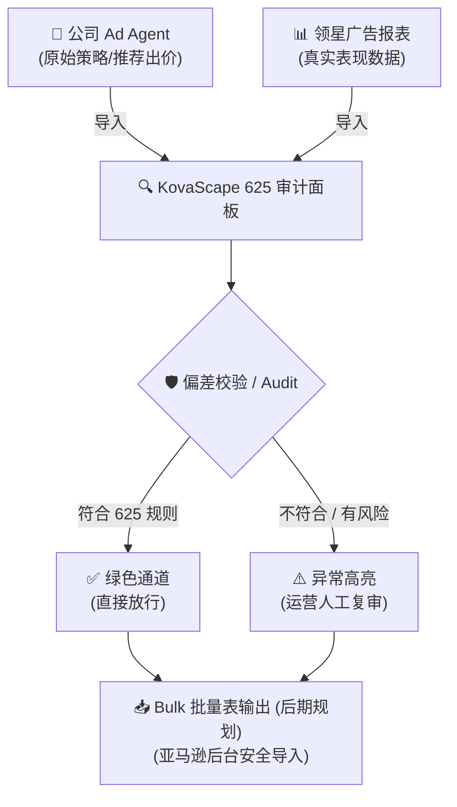

| 子功能 | 描述 | 提纯/防冲突逻辑 | 数据源 |
|--------|------|----------------|--------|
| 625 矩阵评级 | 对广告活动及关键词进行 ACOS/曝光/CTR/CVR 四维评估 | 基础等级划分，提供本组运营直观评判 | 领星导出的广告报告 |
| 策略偏差核对 | 导入公司 AI 策略，与 625 评级交叉比对 | 自动筛选出公司建议与 625 法则存在偏差的行，并进行红色预警 | 公司系统策略 CSV + 领星报告 |
| 决策数据提纯 | 筛选出吸血词（精准否定候选）与黄金词（ harvest 候选） | 给运营组长提供手动决策依据，不自动同步后台 | 领星报告 |
| 批量表生成 (后期) | 确认策略后，自动生成 Amazon SP Bulk 模板表 | 目前版本仅做分析提示，后期逐步加入 Bulk 表生成功能 | 本地分析结果 |

> [!NOTE]
> **已有基础（丰富）**:
> - [广告综合分析面板 v6.10](file:///d:/Zero%20Tools/AI%E5%B7%A5%E5%85%B7/%E5%B9%BF%E5%91%8A%E7%BB%BC%E5%90%88%E5%88%86%E6%9E%90%E9%9D%A2%E6%9D%BF_v6.10.html) — 核心广告分析工具
> - [ads_panel](file:///d:/Zero%20Tools/ads_panel.html) — 广告面板
> - [Keywords Tagger](file:///d:/Zero%20Tools/amazon-keywords-tagger) — 关键词标签系统
> - [销量分析助手 v2.5](file:///d:/Zero%20Tools/AI%E5%B7%A5%E5%85%B7/%E9%94%80%E9%87%8F%E5%88%86%E6%9E%90%E5%8A%A9%E6%89%8Bv2.5.html) — 销量趋势分析
> - [Applo Blog 知识库](file:///d:/Zero%20Tools/Applo%20Blog) — 51篇广告投放策略文章，可作为 RAG 知识源

---

### 🎯 模块 7: 站内活动

**目标**: 高效管理站内促销活动，数据化评估活动效果。

| 子功能 | 描述 | AI 参与 |
|--------|------|---------|
| 活动日历 | Deal/Coupon/PED等活动排期 | 自动提醒 |
| 自动提报 | Lightning Deal/BD等自动提报 | 表单自动填写 |
| 折扣计算器 | 基于利润率计算最优折扣力度 | 优化算法 |
| 活动对比 | 活动前/中/后 销量/排名/流量对比 | 自动生成分析报告 |
| 竞品活动监控 | 竞品促销动态追踪 | 网页监控 |

---

### 🤝 模块 8: 亚马逊联盟营销

**目标**: 管理 Amazon Associates 和 Brand Referral Bonus 渠道。

| 子功能 | 描述 | AI 参与 |
|--------|------|---------|
| 联盟链接管理 | 批量生成/追踪联盟链接 | 自动化 |
| BRB (Brand Referral Bonus) | 站外引流奖励追踪 | 数据分析 |
| 渠道效果分析 | 各引流渠道ROI对比 | AI洞察 |
| Attribution报告 | Amazon Attribution归因分析 | 自动归因 |

> [!NOTE]
> **已有基础**: [AMC受众策略报告](file:///d:/Zero%20Tools/AI%E5%B7%A5%E5%85%B7/Report/amc-shelf-audience-strategy.html) 已有AMC分析能力。

---

### 🌐 模块 9: 独立站运营

**目标**: 建立DTC独立站，与亚马逊形成多渠道矩阵。

| 子功能 | 描述 | AI 参与 |
|--------|------|---------|
| 建站/内容管理 | Shopify/WordPress站点维护 | AI生成产品页 |
| SEO优化 | 关键词/meta/结构化数据 | AI SEO文案 |
| 邮件营销 | EDM序列设计+自动化 | AI邮件撰写 |
| 落地页设计 | 产品落地页A/B测试 | AI设计建议 |
| 流量分析 | GA4+UTM归因 | 数据可视化 |

---

### 📱 模块 10: 社媒运营

**目标**: 多平台社交媒体内容自动化生产与发布。

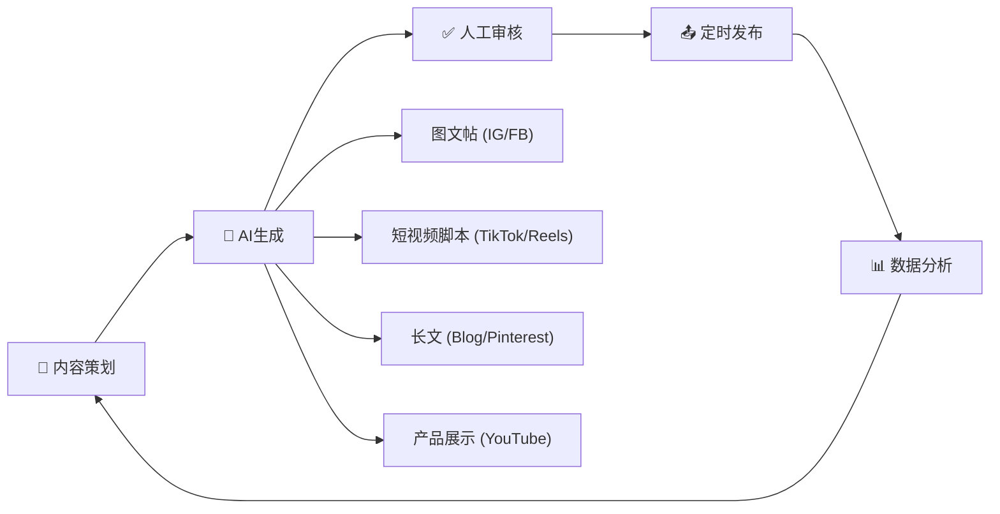

| 子功能 | 描述 | AI 参与 |
|--------|------|---------|
| 内容日历 | 多平台内容排期管理 | AI建议最佳发布时间 |
| AI内容生成 | 图文/视频脚本/hashtag | GPT + DALL·E |
| 多平台发布 | 一键多平台同步发布 | API自动化 |
| 互动管理 | 评论/DM自动回复 | AI客服 |
| 数据分析 | 各平台互动/增长数据 | 趋势分析 |

---

### 🌟 模块 11: 红人开发

**目标**: AI驱动的红人发现、筛选、邀约和管理。

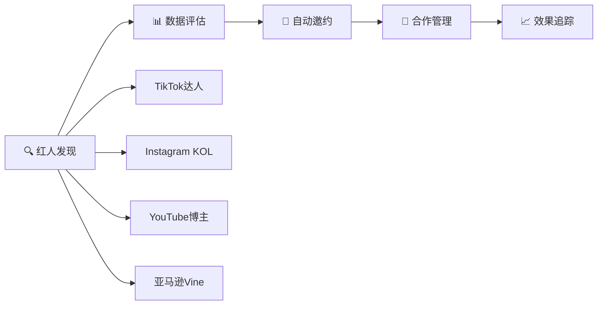

| 子功能 | 描述 | AI 参与 |
|--------|------|---------|
| 红人搜索 | 按品类/粉丝量/互动率筛选 | AI匹配推荐 |
| 红人评估 | 粉丝质量/带货能力评分 | ML评分模型 |
| 邀约模板 | 个性化邀约邮件生成 | GPT个性化生成 |
| 合作CRM | 红人合作全流程管理 | 自动化跟进 |
| ROI追踪 | 红人带货效果归因 | Attribution分析 |

---

### 🔬 模块 12: 产品开发

**目标**: AI赋能的市场洞察和需求发现，降低选品失败率。

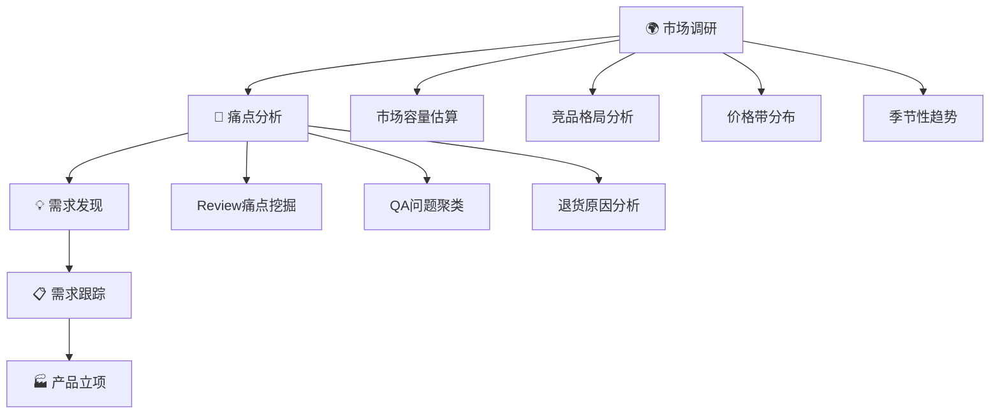

| 子功能 | 描述 | AI 参与 | 数据源 |
|--------|------|---------|--------|
| 市场容量分析 | 品类搜索量/销量估算 | AI预测模型 | ABA + 第三方 |
| 竞品深度分析 | 竞品ASIN级别全维度对标 | AI自动生成报告 | SP-API + 爬虫 |
| Review痛点挖掘 | 差评主题聚类+改进建议 | NLP主题模型 | SP-API |
| 需求趋势追踪 | Google Trends + 社媒热度 | 趋势预测 | 多源 |
| 产品立项看板 | 从调研到上架全流程管理 | 项目管理 | 内部 |

> [!NOTE]
> **已有基础**: [西柚数据对比面板 v1.5](file:///d:/Zero%20Tools/AI%E5%B7%A5%E5%85%B7/%E8%A5%BF%E6%9F%9A%E6%95%B0%E6%8D%AE%E5%AF%B9%E6%AF%94%E9%9D%A2%E6%9D%BF_v1.5.html) 已有竞品对比能力。

---

## 4. 全局业务流程图 / Global Business Flow

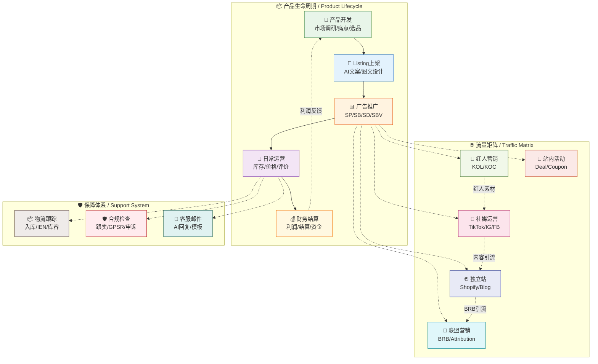

---

## 5. 开发优先级与里程碑 / Priority & Milestones

### 5.1 优先级矩阵

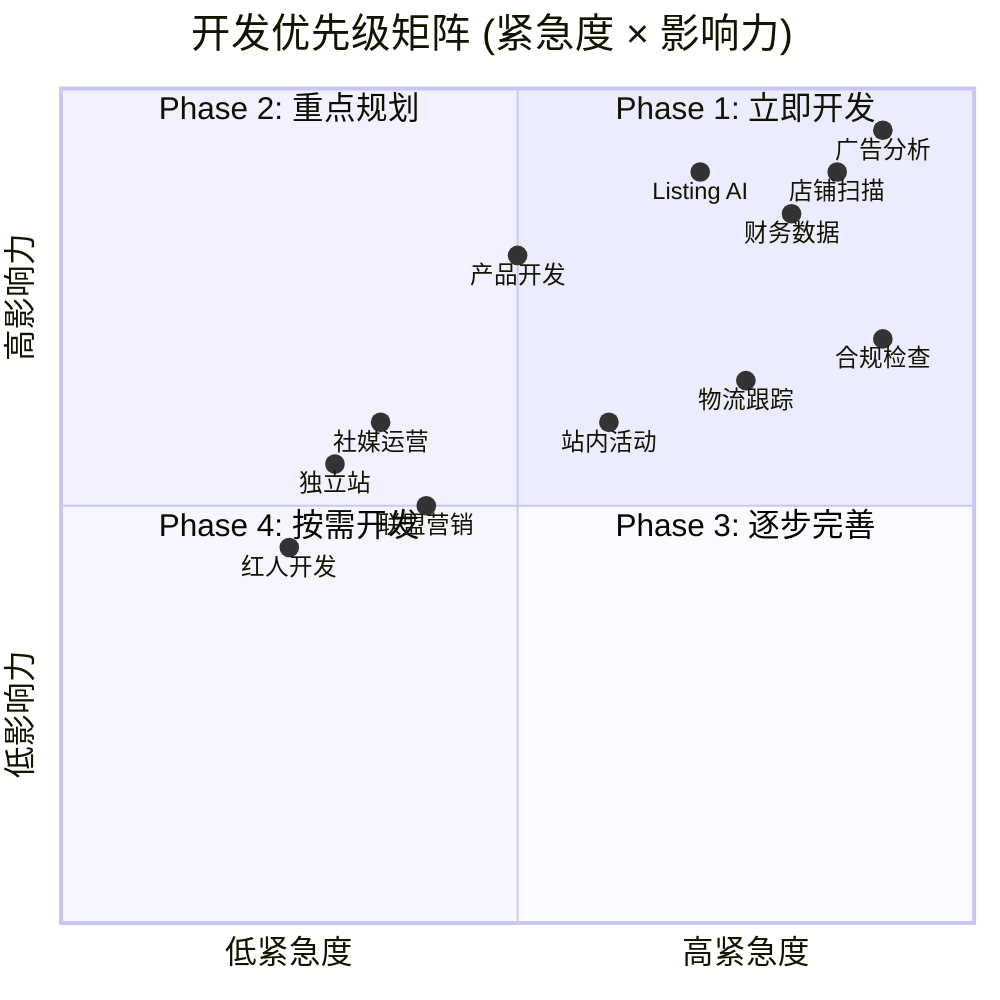

### 5.2 分阶段交付计划

#### 🔴 Phase 1: 核心运营引擎 (Month 1-2)

> **目标**: 稳固日常运营基盘，实现数据自动化

| 周 | 模块 | 交付物 | 关键依赖 |
|----|------|--------|---------|
| W1-W2 | 平台框架 | Hub升级 + 统一数据层 + 用户认证 | Next.js + FastAPI搭建 |
| W3-W4 | #1 店铺扫描 | 库存健康检查 + 库龄预警 + 自动报告 | SP-API接入 |
| W5-W6 | #6 广告分析 | 现有面板升级 + AI优化建议 + 自动否词 | Ads API接入 |
| W7-W8 | #4 财务数据 | 订单利润 + 资金看板 + 结算追踪 | SP-API Financial |

**Phase 1 MVP 核心指标**:
- ✅ SP-API / Ads API 对接完成
- ✅ 库存健康检查自动化（每日扫描）
- ✅ 广告数据自动拉取 + AI建议生成
- ✅ SKU级利润自动计算

---

#### 🟡 Phase 2: AI赋能升级 (Month 3-4)

> **目标**: AI深度参与日常运营，提升效率10倍

| 周 | 模块 | 交付物 | 关键依赖 |
|----|------|--------|---------|
| W9-W10 | #5 Listing AI | AI文案生成 + 多语言翻译 + 关键词工具 | LLM API |
| W11-W12 | #3 合规检查 | 跟卖检测 + GPSR检查 + 申诉模板 | SP-API + 规则引擎 |
| W13-W14 | #2 物流跟踪 | 物流全链路 + IEN回填 + 库容监控 | 领星API + SP-API |
| W15-W16 | #7 站内活动 | 活动管理 + 折扣计算 + 效果对比 | SP-API |

**Phase 2 核心指标**:
- ✅ Listing撰写效率提升 80% (从2小时→20分钟)
- ✅ 合规风险自动检测覆盖 95%
- ✅ 物流状态实时可见

---

#### 🟢 Phase 3: 流量矩阵 (Month 5-6)

> **目标**: 构建站外流量体系，形成完整营销闭环

| 周 | 模块 | 交付物 | 关键依赖 |
|----|------|--------|---------|
| W17-W18 | #12 产品开发 | 市场调研 + 竞品分析 + Review挖掘 | 爬虫 + NLP |
| W19-W20 | #10 社媒运营 | 内容日历 + AI生成 + 多平台发布 | 社媒API |
| W21-W22 | #11 红人开发 | 红人搜索 + 评估 + 邀约管理 | 社媒API + CRM |
| W23-W24 | #8/#9 联盟/独立站 | BRB管理 + DTC站点 + 邮件营销 | Shopify API |

**Phase 3 核心指标**:
- ✅ 站外流量占比提升至 15%+
- ✅ 红人合作管道建立
- ✅ 独立站上线并引流

---

#### 🔵 Phase 4: 智能化进阶 (Month 7+)

> **目标**: 深度AI能力，实现预测性运营

| 模块 | 交付物 |
|------|--------|
| AI Agent | 自主运营Agent（自动调价/补货/否词） |
| 需求预测 | 基于ML的销量预测 + 补货建议 |
| 竞争情报 | 实时竞品动态 + 市场份额追踪 |
| 知识图谱 | 运营知识库 + RAG智能问答 |
| 绩效系统 | 运营人员KPI看板 + 团队协作 |

---

## 6. 数据对接与集成规划 / Data Integration & Bulk Operations

由于目前采用文件级（CSV/XLSX）对接，技术集成的核心是**本地解析规范与批量操作表（Bulk Sheet）的自动生成**。

### 6.1 本地 CSV/XLSX 数据源解析规划

| 数据源 | 导出系统 | 核心提取指标 | 对应小组定制功能 |
|--------|---------|-------------|-----------------|
| **决策与排产 CSV** | 公司系统 | 销量预测、推荐排产计划、建仓数据 | 本组专属筛选、甘特图排产推演、国内/国内仓在途模拟 |
| **广告活动报告** | 领星 ERP / 亚马逊 | 广告活动、ACOS、Spend、Impressions、Clicks | **625 矩阵分析**、吸血词与金词提纯筛选 |
| **库存/销量报表** | 领星 ERP | 可售现货、国内库存、在途件、7d/30d 销量 | 甘特图断货推演、红黄绿灯水位监控 |
| **财务月报表** | 领星 ERP | 销售额、FBA费用、退款额、广告费、结算周期 | 本组 SKU 级别真实损益表（P&L）与利润分摊 |

### 6.2 亚马逊广告 Bulk 批量操作表生成器 (Bulk Spreadsheet Generator)

当公司 Ad AI Agent 给出策略后，本组工具进行**二次提纯**，并自动生成亚马逊 Bulk 批量操作模板：
- **Sponsored Products Bulk Template**：自动生成包含 `Record Type` (Campaign/Ad Group/Keyword/Product Ad)、`Action` (Update/Create)、`Bid`、`Status` 的 Bulk 表。
- **批量否词表**：将过滤出的“吸血词”（高消费无转化）自动输出为 Campaign/Ad Group 级别的否定关键词 Bulk 行。
- **批量调价表**：基于 `625 广告法` 的调价公式，将提纯后的关键词出价自动写入 Bulk 表，运营只需在亚马逊后台一键上传，即可批量生效。

### 6.3 亚马逊 SP-API 申请与过渡方案
- **阶段一 (当前)**：运营人员通过浏览器下载领星及亚马逊后台报表，拖拽上传至本平台，由 Python (FastAPI/Pandas) 后端解析入库。
- **阶段二 (接口通过后)**：配置 SP-API 开发者密钥，自动激活后台 Celery 定时任务，每日凌晨自动拉取 `GET_FBA_MYI_UNSUPPRESSED_INVENTORY_DATA` (库存报告) 等，实现无感更新。

### 6.3 第三方API

| API | 用途 | 对应模块 |
|-----|------|---------|
| 领星 ERP API | 进销存/物流 | #1, #2, #4 |
| OpenAI / Claude API | AI文案/分析 | #5, #10 |
| TikTok API | 社媒发布/数据 | #10, #11 |
| Instagram Graph API | 社媒管理 | #10, #11 |
| Shopify API | 独立站管理 | #9 |
| Google Trends API | 趋势数据 | #12 |
| Keepa / Jungle Scout API | 市场数据 | #12 |

---

## 7. 数据流设计 / Data Flow

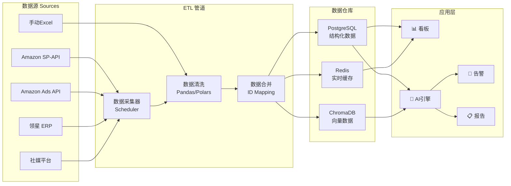

---

---

## 8. 信息推送与告警中心 / Notification & Alert Center

**目标**: 建立多渠道、分级响应的智能消息推送与告警中心，确保异常事件第一时间触达运营与管理团队。

### 8.1 核心需求与架构

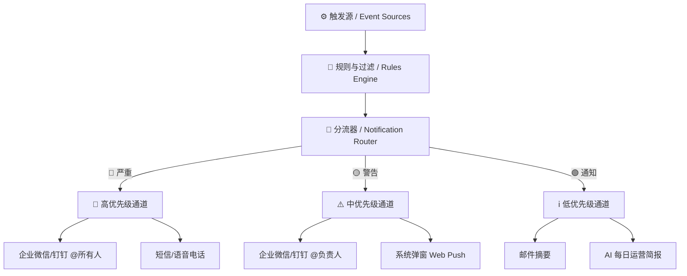

### 8.2 推送渠道规划

| 渠道名称 | 用途 | 适用场景 | 优先级 |
|----------|------|----------|--------|
| **企业微信/钉钉 Webhook** | 日常监控告警与群协作 | 异常检测、日常通知 | 🔴 严重 / 🟡 警告 |
| **邮件推送** | 深度分析报告、周复盘汇总 | 每日利润/广告结算简报 | 🟢 通知 |
| **Web Push (浏览器通知)** | 运营登录平台时的实时消息提醒 | Listing状态变更、竞品价格微调 | 🟡 警告 / 🟢 通知 |
| **短信 / 语音告警** | 关乎店铺生死的极度严重事件 | 店铺被封 (Suspended)、大批量下架 | 🔴 严重 |

### 8.3 智能推送场景

#### 1. 供应链与库存预警
- **断货红灯预警**：FBA 现货 DOS < 15 天时，自动推送至对应运营人员。
- **工厂交期异常**：排产交期延误自动预警推送。
- **库容溢出**：库容利用率达到 90% 时触发预警。

#### 2. 合规与安全监控
- **跟卖入侵检测**：检测到有未授权卖家抢占 Buy Box，立即触发企业微信群告警，并 @对应运营负责人。
- **Listing 下架告警**：Listing 状态突变（Active -> Inactive），触发最高级别告警。
- **GPSR 违规提示**：法规强制执行节点前的合规缺失提醒。

#### 3. 广告与业绩异动
- **预算撞顶提醒**：核心 Campaign 预算在中午前消耗完时推送，提醒是否追加预算。
- **ACOS 异常爆仓**：单日 ACOS 超过设定的上限值（如 60%）时自动提醒。
- **自然排名骤降**：监控核心词排名跌出前三页时推送。

#### 4. AI 运营简报 (Daily Digest)
- **AI 智能早报**：每天早上 8:30，AI 自动汇总昨日销售额、利润率、广告 ACOS、待补货 SKU，并附带一条“100字AI优化诊断建议”推送到管理群。

---

## 9. 已定决策与技术基调 (Resolved Technical Decisions)

根据与您的沟通，本项目已确定以下核心技术决策与业务基调：

1. **零API依赖本地优先 (Local-First, No Corporate API)**
   - 无法获取公司系统与领星的 API。
   - 采用 **CSV/XLSX 文件解析模式**：本平台提供数据上传面板，读取领星和公司系统导出的销量预测、采购排产、广告活动等 CSV/Excel 报告。
   
2. **广告二次提纯与防冲突核对模式 (625 Refinement & Anti-Conflict Audit)**
   - **防冲突设计**：为了避免与公司 enterprise Ad AI Agent 重复调价产生冲突，本项目不做自动调价出价，而是定位为 **「被动审计过滤器」**。
   - **核对流程**：导入公司系统的策略或报告，结合本组 `625 广告法` 找出异常决策点进行高亮报警，由运营组长核对后决定是否“放行”。
   - **Bulk 操作表规划**：现阶段的广告面板内置了分析参数与建议，但不直接生成亚马逊 Bulk 表。批量生成 Bulk 导出表功能将作为**后期规划**逐步引入。
3. **SP-API 双规过渡方案**
   - 亚马逊 SP-API 接口目前正在申请中。平台优先开发“本地 Excel/CSV 解析器”保障当前使用；接口获批后，无缝切换为 API 自动同步。
   
4. **本组差异化竞争优势工具化**
   - 平台核心优势在于：对品牌调性的精准把控、高水平的 AI 结合度，以及丰富的 HTML 辅助小工具。
   - 开发资源为**本组自主开发**（由运营与 AI 协作实现，不依赖外部 IT 部门）。

5. **系统框架：KovaScape Hub 架构**
   - 平台以 `kovascape-hub.html` 为统一入口，通过 Python 本地服务（`launcher_service.py`）拉起各 HTML 专属面板，数据完全存储在本地，安全性 100%。

## 10. 阶段性开发核心版块 (Prioritized Development Blocks)

根据本组当前的 API 授权现状及业务急迫度，平台开发划分为以下 **5 大核心优先版块**：

### 🧱 版块 1: 数据中枢与店铺扫描 (ERP 报表解析 → SP-API 过渡)
- **阶段一 (API 未就绪)**：重点开发**本地领星报表解析器**。运营人员下载领星 CSV 报表（库存、销售、在途），拖拽导入平台进行二次过滤与本地推演，输出本组专属决策视图。
- **阶段二 (SP-API 获批后)**：全面接入 SP-API，激活**店铺异常扫描与监控看板**（链接丢失、Buy Box 丢失、价格变动、库存红灯等自动告警）。

### 🧱 版块 2: Listing 全链路图文视频工作流 (Listing-图片-A+视频)
- **文案工作流**：结合 ABA 词库进行 AI 标题/五点描述 (BP)/产品描述一键生成与多语言精译。
- **图片工作流**：AI 主副图设计方案生成，自动提取竞品图片素材并按 ASIN 归类建档。
- **A+ 与视频**：自动输出 A+ 模块排版方案、主图视频脚本及分镜脚本。

### 🧱 版块 3: 广告提纯面板与 AI 诊断 (广告分析面板 + AI 判断)
- **625 矩阵**：导入领星广告报告，应用 625 分析法进行被动式广告数据评级。
- **AI 决策核对**：导入公司系统的 AI 策略进行偏差审计。高亮不符合本组 625 逻辑的出价和否词动作。
- **Bulk 操作表 (中后期)**：审核无误后，手动一键放行导出 Amazon SP Bulk 批量表。

### 🧱 版块 4: 独立站上架与内容运营 (独立站产品上架 / SEO / GEO / 图文)
- **产品一键上架**：将亚马逊 Listing 提纯后的数据，一键自动转换为 Shopify 格式上架。
- **SEO/GEO 优化**：AI 批量生成元数据 (Metadata)、结构化 Schema，针对 Google 搜索与 AI Overviews 进行可读性优化。
- **独立站图文**：AI 生成独立站专属图文博客、EDM 营销邮件。

### 🧱 版块 5: 一键多渠道社媒分发系统 (主题多格式分发)
- **一键格式转换**：输入一个产品核心主题，AI 自动生成适合不同平台（TikTok 短视频脚本、Instagram 视觉文案、Facebook 互动贴、Pinterest 种草图）的文案与排版格式。
- **多渠道分发**：提供排期日历，并支持一键（通过 API 或引导手动）分发到各社媒平台。

## 11. 验证计划 / Verification Plan

### 自动化测试
- 各个解析器对 Excel/CSV 报表的解析正确率测试 (100% 匹配列名)
- Bulk 批量上传模板生成的字段规范性校验 (必须符合 Amazon 最新 Bulk 模版格式)
- 本地 Python HTTP 服务连通性测试

### 手动验证
- 运营人员手动上传领星报表并校验数据正确性
- 生成 Bulk 批量表后，手动在亚马逊后台进行上传验证，确认无报错
- 确认甘特图等可视化看板对排产天数的推演符合预期

---

> **文档状态**: 🟢 已确认决策，正式进入开发执行阶段。
> 
> **下一步**: 我将创建 `task.md` 任务清单，并开始 Phase 1 的具体编码实施。
