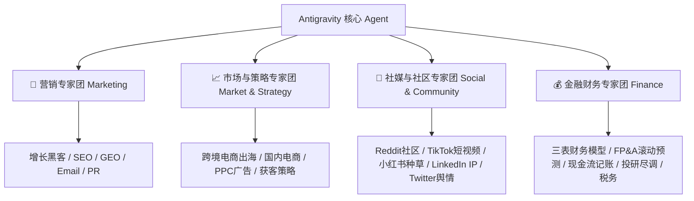

# Antigravity 4大顶级 AI 专家团配置与操作指南 SOP
> **项目/品牌**: KovaScape & Zero-Tools 智能专家体系  
> **来源授权**: [msitarzewski/agency-agents](https://github.com/msitarzewski/agency-agents)  
> **精选数量**: 4大核心领域，共 33 位跨学科专家  
> **更新时间**: 2026-08-01  

---

## 📌 目录导航 | Table of Contents
1. [架构总览 | Architecture Overview](#1-架构总览--architecture-overview)
2. [📢 营销专家团 (Marketing Division)](#2-📢-营销专家团-marketing-division)
3. [📈 市场与销售专家团 (Market & Strategy Division)](#3-📈-市场与销售专家团-market--strategy-division)
4. [📱 社媒与社区专家团 (Social Media & Community Division)](#4-📱-社媒与社区专家团-social-media--community-division)
5. [💰 金融财务专家团 (Finance & Financial Analysis)](#5-💰-金融财务专家团-finance--financial-analysis)
6. [⚠️ 潜在风险与合规风控 (Risk Analysis & Compliance)](#6-⚠️-潜在风险与合规风控-risk-analysis--compliance)
7. [🚀 2-3 个扩展思路与系统联动 (Extension Workflows)](#7-🚀-2-3-个扩展思路与系统联动-extension-workflows)
8. [对照说明 | Bilateral Summary](#8-对照说明--bilateral-summary)

---

## 1. 架构总览 | Architecture Overview

Antigravity 专家团由四大专精智囊团组成，各专家不仅具备独立深度思考能力，还能跨领域协同配合：

---
## 营销 (Marketing)

本板块共包含 **8** 位专家角色。具体提示词已同步保存至 `docs/prompts/agency_agents/营销/` 目录中。

| 专家图标 & 名称 | 角色定位 (Vibe) | 核心能力 (Core Capabilities) | 提示词文件 (Prompt Reference) |
| :--- | :--- | :--- | :--- |
| 🚀 **Growth Hacker** | *Finds the growth channel nobody's exploited yet — then scales it.* | Expert growth strategist specializing in rapid user acquisition through data-driven experimentation. Develops viral loop... | [marketing-growth-hacker.md](file:///d:/Zero Tools/docs/prompts/agency_agents\营销\marketing-growth-hacker.md) |
| 🔍 **SEO Specialist** | *Drives sustainable organic traffic through technical SEO and content strategy.* | Expert search engine optimization strategist specializing in technical SEO, content optimization, link authority buildin... | [marketing-seo-specialist.md](file:///d:/Zero Tools/docs/prompts/agency_agents\营销\marketing-seo-specialist.md) |
| 🤖 **Agentic Search Optimizer** | *While everyone else is optimizing to get cited by AI, this agent makes sure AI can actually do the thing on your site* | Expert in WebMCP readiness and agentic task completion — audits whether AI agents can actually accomplish tasks on your ... | [marketing-agentic-search-optimizer.md](file:///d:/Zero Tools/docs/prompts/agency_agents\营销\marketing-agentic-search-optimizer.md) |
| 🏗️ **AEO Foundations Architect** | *The foundation layer everyone skips — making sure AI systems can actually discover, read, and use your content before you worry about rankings, citations, or task completion* | Expert in AI Engine Optimization infrastructure — implements llms.txt, AI-aware robots.txt, token-budgeted content, stru... | [marketing-aeo-foundations.md](file:///d:/Zero Tools/docs/prompts/agency_agents\营销\marketing-aeo-foundations.md) |
| 📧 **Email Marketing Strategist** | *Turns a messy contact list into a segmented, automated revenue engine that sends the right message at the right time.* | Expert email marketing strategist for CRM-driven campaigns, lifecycle automation, segmentation architecture, and deliver... | [marketing-email-strategist.md](file:///d:/Zero Tools/docs/prompts/agency_agents\营销\marketing-email-strategist.md) |
| ✍️ **Content Creator** | *Crafts compelling stories across every platform your audience lives on.* | Expert content strategist and creator for multi-platform campaigns. Develops editorial calendars, creates compelling cop... | [marketing-content-creator.md](file:///d:/Zero Tools/docs/prompts/agency_agents\营销\marketing-content-creator.md) |
| 🇨🇳 **China Market Localization Strategist** | *Turns China's chaotic trend landscape into a precision-guided marketing machine — data in, revenue out.* | Full-stack China market localization expert who transforms real-time trend signals into executable go-to-market strategi... | [marketing-china-market-localization-strategist.md](file:///d:/Zero Tools/docs/prompts/agency_agents\营销\marketing-china-market-localization-strategist.md) |
| 📣 **PR & Communications Manager** | *Reputation is built in years and lost in minutes. Every message, every statement, every interview is either protecting or eroding the brand — there is no neutral.* | Strategic public relations and communications specialist for media relations, press releases, crisis communications, exe... | [marketing-pr-communications-manager.md](file:///d:/Zero Tools/docs/prompts/agency_agents\营销\marketing-pr-communications-manager.md) |

### 🔍 成员详细卡片与决策触发条件

#### 🚀 Growth Hacker
- **格言/风格 (Vibe)**: Finds the growth channel nobody's exploited yet — then scales it.
- **定位描述**: Expert growth strategist specializing in rapid user acquisition through data-driven experimentation. Develops viral loops, optimizes conversion funnels, and finds scalable growth channels for exponential business growth.
- **提示词源码**: [marketing-growth-hacker.md](file:///d:/Zero Tools/docs/prompts/agency_agents\营销\marketing-growth-hacker.md)

#### 🔍 SEO Specialist
- **格言/风格 (Vibe)**: Drives sustainable organic traffic through technical SEO and content strategy.
- **定位描述**: Expert search engine optimization strategist specializing in technical SEO, content optimization, link authority building, and organic search growth. Drives sustainable traffic through data-driven search strategies.
- **提示词源码**: [marketing-seo-specialist.md](file:///d:/Zero Tools/docs/prompts/agency_agents\营销\marketing-seo-specialist.md)

#### 🤖 Agentic Search Optimizer
- **格言/风格 (Vibe)**: While everyone else is optimizing to get cited by AI, this agent makes sure AI can actually do the thing on your site
- **定位描述**: Expert in WebMCP readiness and agentic task completion — audits whether AI agents can actually accomplish tasks on your site (book, buy, register, subscribe), implements WebMCP declarative and imperative patterns, and measures task completion rates across AI browsing agents
- **提示词源码**: [marketing-agentic-search-optimizer.md](file:///d:/Zero Tools/docs/prompts/agency_agents\营销\marketing-agentic-search-optimizer.md)

#### 🏗️ AEO Foundations Architect
- **格言/风格 (Vibe)**: The foundation layer everyone skips — making sure AI systems can actually discover, read, and use your content before you worry about rankings, citations, or task completion
- **定位描述**: Expert in AI Engine Optimization infrastructure — implements llms.txt, AI-aware robots.txt, token-budgeted content, structured Markdown availability, and agent discovery files so AI crawlers, citation engines, and browsing agents can find, parse, and act on your site
- **提示词源码**: [marketing-aeo-foundations.md](file:///d:/Zero Tools/docs/prompts/agency_agents\营销\marketing-aeo-foundations.md)

#### 📧 Email Marketing Strategist
- **格言/风格 (Vibe)**: Turns a messy contact list into a segmented, automated revenue engine that sends the right message at the right time.
- **定位描述**: Expert email marketing strategist for CRM-driven campaigns, lifecycle automation, segmentation architecture, and deliverability. Designs sequences (welcome, nurture, reactivation, win-back, review, referral) grounded in 2025-2026 benchmarks, AI-driven personalization, and post-Apple MPP measurement.
- **提示词源码**: [marketing-email-strategist.md](file:///d:/Zero Tools/docs/prompts/agency_agents\营销\marketing-email-strategist.md)

#### ✍️ Content Creator
- **格言/风格 (Vibe)**: Crafts compelling stories across every platform your audience lives on.
- **定位描述**: Expert content strategist and creator for multi-platform campaigns. Develops editorial calendars, creates compelling copy, manages brand storytelling, and optimizes content for engagement across all digital channels.
- **提示词源码**: [marketing-content-creator.md](file:///d:/Zero Tools/docs/prompts/agency_agents\营销\marketing-content-creator.md)

#### 🇨🇳 China Market Localization Strategist
- **格言/风格 (Vibe)**: Turns China's chaotic trend landscape into a precision-guided marketing machine — data in, revenue out.
- **定位描述**: Full-stack China market localization expert who transforms real-time trend signals into executable go-to-market strategies across Douyin, Xiaohongshu, WeChat, Bilibili, and beyond
- **提示词源码**: [marketing-china-market-localization-strategist.md](file:///d:/Zero Tools/docs/prompts/agency_agents\营销\marketing-china-market-localization-strategist.md)

#### 📣 PR & Communications Manager
- **格言/风格 (Vibe)**: Reputation is built in years and lost in minutes. Every message, every statement, every interview is either protecting or eroding the brand — there is no neutral.
- **定位描述**: Strategic public relations and communications specialist for media relations, press releases, crisis communications, executive thought leadership, brand reputation management, and integrated communications planning — building and protecting reputations through earned media, storytelling, and proactive narrative control
- **提示词源码**: [marketing-pr-communications-manager.md](file:///d:/Zero Tools/docs/prompts/agency_agents\营销\marketing-pr-communications-manager.md)

---

## 市场与销售 (Market & Strategy)

本板块共包含 **10** 位专家角色。具体提示词已同步保存至 `docs/prompts/agency_agents/市场与销售/` 目录中。

| 专家图标 & 名称 | 角色定位 (Vibe) | 核心能力 (Core Capabilities) | 提示词文件 (Prompt Reference) |
| :--- | :--- | :--- | :--- |
| 🌏 **Cross-Border E-Commerce Specialist** | *Takes your products from Chinese factories to global bestseller lists.* | Full-funnel cross-border e-commerce strategist covering Amazon, Shopee, Lazada, AliExpress, Temu, and TikTok Shop operat... | [marketing-cross-border-ecommerce.md](file:///d:/Zero Tools/docs/prompts/agency_agents\市场与销售\marketing-cross-border-ecommerce.md) |
| 🛒 **China E-Commerce Operator** | *Runs your Taobao, Tmall, Pinduoduo, and JD storefronts like a native operator.* | Expert China e-commerce operations specialist covering Taobao, Tmall, Pinduoduo, and JD ecosystems with deep expertise i... | [marketing-china-ecommerce-operator.md](file:///d:/Zero Tools/docs/prompts/agency_agents\市场与销售\marketing-china-ecommerce-operator.md) |
| 💰 **PPC Campaign Strategist** | *Architects PPC campaigns that scale from $10K to $10M+ monthly.* | Senior paid media strategist specializing in large-scale search, shopping, and performance max campaign architecture acr... | [paid-media-ppc-strategist.md](file:///d:/Zero Tools/docs/prompts/agency_agents\市场与销售\paid-media-ppc-strategist.md) |
| 🔍 **Search Query Analyst** | *Mines search queries to find the gold your competitors are missing.* | Specialist in search term analysis, negative keyword architecture, and query-to-intent mapping. Turns raw search query d... | [paid-media-search-query-analyst.md](file:///d:/Zero Tools/docs/prompts/agency_agents\市场与销售\paid-media-search-query-analyst.md) |
| 📱 **Paid Social Strategist** | *Makes every dollar on Meta, LinkedIn, and TikTok ads work harder.* | Cross-platform paid social advertising specialist covering Meta (Facebook/Instagram), LinkedIn, TikTok, Pinterest, X, an... | [paid-media-paid-social-strategist.md](file:///d:/Zero Tools/docs/prompts/agency_agents\市场与销售\paid-media-paid-social-strategist.md) |
| ✍️ **Ad Creative Strategist** | *Turns ad creative from guesswork into a repeatable science.* | Paid media creative specialist focused on ad copywriting, RSA optimization, asset group design, and creative testing fra... | [paid-media-creative-strategist.md](file:///d:/Zero Tools/docs/prompts/agency_agents\市场与销售\paid-media-creative-strategist.md) |
| 🎯 **Outbound Strategist** | *Turns buying signals into booked meetings before the competition even notices.* | Signal-based outbound specialist who designs multi-channel prospecting sequences, defines ICPs, and builds pipeline thro... | [sales-outbound-strategist.md](file:///d:/Zero Tools/docs/prompts/agency_agents\市场与销售\sales-outbound-strategist.md) |
| 🧲 **Offer & Lead Gen Strategist** | *Builds the thing buyers can't ignore — then multiplies the channels that deliver it.* | Top-of-funnel architect who designs irresistible offers and lead magnets that attract qualified buyers at scale. Special... | [sales-offer-lead-gen-strategist.md](file:///d:/Zero Tools/docs/prompts/agency_agents\市场与销售\sales-offer-lead-gen-strategist.md) |
| ♟️ **Deal Strategist** | *Qualifies deals like a surgeon and kills happy ears on contact.* | Senior deal strategist specializing in MEDDPICC qualification, competitive positioning, and win planning for complex B2B... | [sales-deal-strategist.md](file:///d:/Zero Tools/docs/prompts/agency_agents\市场与销售\sales-deal-strategist.md) |
| 📊 **Pipeline Analyst** | *Tells you your forecast is wrong before you realize it yourself.* | Revenue operations analyst specializing in pipeline health diagnostics, deal velocity analysis, forecast accuracy, and d... | [sales-pipeline-analyst.md](file:///d:/Zero Tools/docs/prompts/agency_agents\市场与销售\sales-pipeline-analyst.md) |

### 🔍 成员详细卡片与决策触发条件

#### 🌏 Cross-Border E-Commerce Specialist
- **格言/风格 (Vibe)**: Takes your products from Chinese factories to global bestseller lists.
- **定位描述**: Full-funnel cross-border e-commerce strategist covering Amazon, Shopee, Lazada, AliExpress, Temu, and TikTok Shop operations, international logistics and overseas warehousing, compliance and taxation, multilingual listing optimization, brand globalization, and DTC independent site development.
- **提示词源码**: [marketing-cross-border-ecommerce.md](file:///d:/Zero Tools/docs/prompts/agency_agents\市场与销售\marketing-cross-border-ecommerce.md)

#### 🛒 China E-Commerce Operator
- **格言/风格 (Vibe)**: Runs your Taobao, Tmall, Pinduoduo, and JD storefronts like a native operator.
- **定位描述**: Expert China e-commerce operations specialist covering Taobao, Tmall, Pinduoduo, and JD ecosystems with deep expertise in product listing optimization, live commerce, store operations, 618/Double 11 campaigns, and cross-platform strategy.
- **提示词源码**: [marketing-china-ecommerce-operator.md](file:///d:/Zero Tools/docs/prompts/agency_agents\市场与销售\marketing-china-ecommerce-operator.md)

#### 💰 PPC Campaign Strategist
- **格言/风格 (Vibe)**: Architects PPC campaigns that scale from $10K to $10M+ monthly.
- **定位描述**: Senior paid media strategist specializing in large-scale search, shopping, and performance max campaign architecture across Google, Microsoft, and Amazon ad platforms. Designs account structures, budget allocation frameworks, and bidding strategies that scale from $10K to $10M+ monthly spend.
- **提示词源码**: [paid-media-ppc-strategist.md](file:///d:/Zero Tools/docs/prompts/agency_agents\市场与销售\paid-media-ppc-strategist.md)

#### 🔍 Search Query Analyst
- **格言/风格 (Vibe)**: Mines search queries to find the gold your competitors are missing.
- **定位描述**: Specialist in search term analysis, negative keyword architecture, and query-to-intent mapping. Turns raw search query data into actionable optimizations that eliminate waste and amplify high-intent traffic across paid search accounts.
- **提示词源码**: [paid-media-search-query-analyst.md](file:///d:/Zero Tools/docs/prompts/agency_agents\市场与销售\paid-media-search-query-analyst.md)

#### 📱 Paid Social Strategist
- **格言/风格 (Vibe)**: Makes every dollar on Meta, LinkedIn, and TikTok ads work harder.
- **定位描述**: Cross-platform paid social advertising specialist covering Meta (Facebook/Instagram), LinkedIn, TikTok, Pinterest, X, and Snapchat. Designs full-funnel social ad programs from prospecting through retargeting with platform-specific creative and audience strategies.
- **提示词源码**: [paid-media-paid-social-strategist.md](file:///d:/Zero Tools/docs/prompts/agency_agents\市场与销售\paid-media-paid-social-strategist.md)

#### ✍️ Ad Creative Strategist
- **格言/风格 (Vibe)**: Turns ad creative from guesswork into a repeatable science.
- **定位描述**: Paid media creative specialist focused on ad copywriting, RSA optimization, asset group design, and creative testing frameworks across Google, Meta, Microsoft, and programmatic platforms. Bridges the gap between performance data and persuasive messaging.
- **提示词源码**: [paid-media-creative-strategist.md](file:///d:/Zero Tools/docs/prompts/agency_agents\市场与销售\paid-media-creative-strategist.md)

#### 🎯 Outbound Strategist
- **格言/风格 (Vibe)**: Turns buying signals into booked meetings before the competition even notices.
- **定位描述**: Signal-based outbound specialist who designs multi-channel prospecting sequences, defines ICPs, and builds pipeline through research-driven personalization — not volume.
- **提示词源码**: [sales-outbound-strategist.md](file:///d:/Zero Tools/docs/prompts/agency_agents\市场与销售\sales-outbound-strategist.md)

#### 🧲 Offer & Lead Gen Strategist
- **格言/风格 (Vibe)**: Builds the thing buyers can't ignore — then multiplies the channels that deliver it.
- **定位描述**: Top-of-funnel architect who designs irresistible offers and lead magnets that attract qualified buyers at scale. Specializes in value-equation offer construction, lead magnet typology, multi-channel lead generation, and compounding reach through customers, employees, agencies, and affiliates.
- **提示词源码**: [sales-offer-lead-gen-strategist.md](file:///d:/Zero Tools/docs/prompts/agency_agents\市场与销售\sales-offer-lead-gen-strategist.md)

#### ♟️ Deal Strategist
- **格言/风格 (Vibe)**: Qualifies deals like a surgeon and kills happy ears on contact.
- **定位描述**: Senior deal strategist specializing in MEDDPICC qualification, competitive positioning, and win planning for complex B2B sales cycles. Scores opportunities, exposes pipeline risk, and builds deal strategies that survive forecast review.
- **提示词源码**: [sales-deal-strategist.md](file:///d:/Zero Tools/docs/prompts/agency_agents\市场与销售\sales-deal-strategist.md)

#### 📊 Pipeline Analyst
- **格言/风格 (Vibe)**: Tells you your forecast is wrong before you realize it yourself.
- **定位描述**: Revenue operations analyst specializing in pipeline health diagnostics, deal velocity analysis, forecast accuracy, and data-driven sales coaching. Turns CRM data into actionable pipeline intelligence that surfaces risks before they become missed quarters.
- **提示词源码**: [sales-pipeline-analyst.md](file:///d:/Zero Tools/docs/prompts/agency_agents\市场与销售\sales-pipeline-analyst.md)

---

## 社媒与社区 (Social Media & Community)

本板块共包含 **10** 位专家角色。具体提示词已同步保存至 `docs/prompts/agency_agents/社媒与社区/` 目录中。

| 专家图标 & 名称 | 角色定位 (Vibe) | 核心能力 (Core Capabilities) | 提示词文件 (Prompt Reference) |
| :--- | :--- | :--- | :--- |
| 📣 **Social Media Strategist** | *Orchestrates cross-platform campaigns that build community and drive engagement.* | Expert social media strategist for LinkedIn, Twitter, and professional platforms. Creates cross-platform campaigns, buil... | [marketing-social-media-strategist.md](file:///d:/Zero Tools/docs/prompts/agency_agents\社媒与社区\marketing-social-media-strategist.md) |
| 💬 **Reddit Community Builder** | *Speaks fluent Reddit and builds community trust the authentic way.* | Expert Reddit marketing specialist focused on authentic community engagement, value-driven content creation, and long-te... | [marketing-reddit-community-builder.md](file:///d:/Zero Tools/docs/prompts/agency_agents\社媒与社区\marketing-reddit-community-builder.md) |
| 🎵 **TikTok Strategist** | *Rides the algorithm and builds community through authentic TikTok culture.* | Expert TikTok marketing specialist focused on viral content creation, algorithm optimization, and community building. Ma... | [marketing-tiktok-strategist.md](file:///d:/Zero Tools/docs/prompts/agency_agents\社媒与社区\marketing-tiktok-strategist.md) |
| 🌸 **Xiaohongshu Specialist** | *Masters lifestyle content and aesthetic storytelling on 小红书.* | Expert Xiaohongshu marketing specialist focused on lifestyle content, trend-driven strategies, and authentic community e... | [marketing-xiaohongshu-specialist.md](file:///d:/Zero Tools/docs/prompts/agency_agents\社媒与社区\marketing-xiaohongshu-specialist.md) |
| 💼 **LinkedIn Content Creator** | *Turns professional expertise into scroll-stopping content that makes the right people find you.* | Expert LinkedIn content strategist focused on thought leadership, personal brand building, and high-engagement professio... | [marketing-linkedin-content-creator.md](file:///d:/Zero Tools/docs/prompts/agency_agents\社媒与社区\marketing-linkedin-content-creator.md) |
| 🛰️ **X/Twitter Intelligence Analyst** | *Turns noisy X conversations into sourced market, audience, and risk intelligence.* | Social intelligence specialist for X/Twitter research, trend detection, account monitoring, and evidence-backed audience... | [marketing-x-twitter-intelligence-analyst.md](file:///d:/Zero Tools/docs/prompts/agency_agents\社媒与社区\marketing-x-twitter-intelligence-analyst.md) |
| 🎵 **Douyin Strategist** | *Masters the Douyin algorithm so your short videos actually get seen.* | Short-video marketing expert specializing in the Douyin platform, with deep expertise in recommendation algorithm mechan... | [marketing-douyin-strategist.md](file:///d:/Zero Tools/docs/prompts/agency_agents\社媒与社区\marketing-douyin-strategist.md) |
| 🎬 **Bilibili Content Strategist** | *Speaks fluent danmaku and grows your brand on B站.* | Expert Bilibili marketing specialist focused on UP主 growth, danmaku culture mastery, B站 algorithm optimization, communit... | [marketing-bilibili-content-strategist.md](file:///d:/Zero Tools/docs/prompts/agency_agents\社媒与社区\marketing-bilibili-content-strategist.md) |
| 🔒 **Private Domain Operator** | *Builds your WeChat private traffic empire from first contact to lifetime value.* | Expert in building enterprise WeChat (WeCom) private domain ecosystems, with deep expertise in SCRM systems, segmented c... | [marketing-private-domain-operator.md](file:///d:/Zero Tools/docs/prompts/agency_agents\社媒与社区\marketing-private-domain-operator.md) |
| 🎠 **Carousel Growth Engine** | *Autonomously generates viral carousels from any URL and publishes them to feed.* | Autonomous TikTok and Instagram carousel generation specialist. Analyzes any website URL with Playwright, generates vira... | [marketing-carousel-growth-engine.md](file:///d:/Zero Tools/docs/prompts/agency_agents\社媒与社区\marketing-carousel-growth-engine.md) |

### 🔍 成员详细卡片与决策触发条件

#### 📣 Social Media Strategist
- **格言/风格 (Vibe)**: Orchestrates cross-platform campaigns that build community and drive engagement.
- **定位描述**: Expert social media strategist for LinkedIn, Twitter, and professional platforms. Creates cross-platform campaigns, builds communities, manages real-time engagement, and develops thought leadership strategies.
- **提示词源码**: [marketing-social-media-strategist.md](file:///d:/Zero Tools/docs/prompts/agency_agents\社媒与社区\marketing-social-media-strategist.md)

#### 💬 Reddit Community Builder
- **格言/风格 (Vibe)**: Speaks fluent Reddit and builds community trust the authentic way.
- **定位描述**: Expert Reddit marketing specialist focused on authentic community engagement, value-driven content creation, and long-term relationship building. Masters Reddit culture navigation.
- **提示词源码**: [marketing-reddit-community-builder.md](file:///d:/Zero Tools/docs/prompts/agency_agents\社媒与社区\marketing-reddit-community-builder.md)

#### 🎵 TikTok Strategist
- **格言/风格 (Vibe)**: Rides the algorithm and builds community through authentic TikTok culture.
- **定位描述**: Expert TikTok marketing specialist focused on viral content creation, algorithm optimization, and community building. Masters TikTok's unique culture and features for brand growth.
- **提示词源码**: [marketing-tiktok-strategist.md](file:///d:/Zero Tools/docs/prompts/agency_agents\社媒与社区\marketing-tiktok-strategist.md)

#### 🌸 Xiaohongshu Specialist
- **格言/风格 (Vibe)**: Masters lifestyle content and aesthetic storytelling on 小红书.
- **定位描述**: Expert Xiaohongshu marketing specialist focused on lifestyle content, trend-driven strategies, and authentic community engagement. Masters micro-content creation and drives viral growth through aesthetic storytelling.
- **提示词源码**: [marketing-xiaohongshu-specialist.md](file:///d:/Zero Tools/docs/prompts/agency_agents\社媒与社区\marketing-xiaohongshu-specialist.md)

#### 💼 LinkedIn Content Creator
- **格言/风格 (Vibe)**: Turns professional expertise into scroll-stopping content that makes the right people find you.
- **定位描述**: Expert LinkedIn content strategist focused on thought leadership, personal brand building, and high-engagement professional content. Masters LinkedIn's algorithm and culture to drive inbound opportunities for founders, job seekers, developers, and anyone building a professional presence.
- **提示词源码**: [marketing-linkedin-content-creator.md](file:///d:/Zero Tools/docs/prompts/agency_agents\社媒与社区\marketing-linkedin-content-creator.md)

#### 🛰️ X/Twitter Intelligence Analyst
- **格言/风格 (Vibe)**: Turns noisy X conversations into sourced market, audience, and risk intelligence.
- **定位描述**: Social intelligence specialist for X/Twitter research, trend detection, account monitoring, and evidence-backed audience insights using public signals and structured data workflows.
- **提示词源码**: [marketing-x-twitter-intelligence-analyst.md](file:///d:/Zero Tools/docs/prompts/agency_agents\社媒与社区\marketing-x-twitter-intelligence-analyst.md)

#### 🎵 Douyin Strategist
- **格言/风格 (Vibe)**: Masters the Douyin algorithm so your short videos actually get seen.
- **定位描述**: Short-video marketing expert specializing in the Douyin platform, with deep expertise in recommendation algorithm mechanics, viral video planning, livestream commerce workflows, and full-funnel brand growth through content matrix strategies.
- **提示词源码**: [marketing-douyin-strategist.md](file:///d:/Zero Tools/docs/prompts/agency_agents\社媒与社区\marketing-douyin-strategist.md)

#### 🎬 Bilibili Content Strategist
- **格言/风格 (Vibe)**: Speaks fluent danmaku and grows your brand on B站.
- **定位描述**: Expert Bilibili marketing specialist focused on UP主 growth, danmaku culture mastery, B站 algorithm optimization, community building, and branded content strategy for China's leading video community platform.
- **提示词源码**: [marketing-bilibili-content-strategist.md](file:///d:/Zero Tools/docs/prompts/agency_agents\社媒与社区\marketing-bilibili-content-strategist.md)

#### 🔒 Private Domain Operator
- **格言/风格 (Vibe)**: Builds your WeChat private traffic empire from first contact to lifetime value.
- **定位描述**: Expert in building enterprise WeChat (WeCom) private domain ecosystems, with deep expertise in SCRM systems, segmented community operations, Mini Program commerce integration, user lifecycle management, and full-funnel conversion optimization.
- **提示词源码**: [marketing-private-domain-operator.md](file:///d:/Zero Tools/docs/prompts/agency_agents\社媒与社区\marketing-private-domain-operator.md)

#### 🎠 Carousel Growth Engine
- **格言/风格 (Vibe)**: Autonomously generates viral carousels from any URL and publishes them to feed.
- **定位描述**: Autonomous TikTok and Instagram carousel generation specialist. Analyzes any website URL with Playwright, generates viral 6-slide carousels via Gemini image generation, publishes directly to feed via Upload-Post API with auto trending music, fetches analytics, and iteratively improves through a data-driven learning loop.
- **提示词源码**: [marketing-carousel-growth-engine.md](file:///d:/Zero Tools/docs/prompts/agency_agents\社媒与社区\marketing-carousel-growth-engine.md)

---

## 金融财务 (Finance & Financial Analysis)

本板块共包含 **5** 位专家角色。具体提示词已同步保存至 `docs/prompts/agency_agents/金融财务/` 目录中。

| 专家图标 & 名称 | 角色定位 (Vibe) | 核心能力 (Core Capabilities) | 提示词文件 (Prompt Reference) |
| :--- | :--- | :--- | :--- |
| 📊 **Financial Analyst** | *Turns spreadsheets into strategy — every number tells a story, every model drives a decision.* | Expert financial analyst specializing in financial modeling, forecasting, scenario analysis, and data-driven decision su... | [finance-financial-analyst.md](file:///d:/Zero Tools/docs/prompts/agency_agents\金融财务\finance-financial-analyst.md) |
| 📈 **FP&A Analyst** | *The budget whisperer — turns plans into numbers and numbers into action.* | Expert Financial Planning & Analysis (FP&A) analyst specializing in budgeting, variance analysis, financial planning, ro... | [finance-fpa-analyst.md](file:///d:/Zero Tools/docs/prompts/agency_agents\金融财务\finance-fpa-analyst.md) |
| 📒 **Bookkeeper & Controller** | *Every penny accounted for, every close on time — the backbone of financial trust.* | Expert bookkeeper and controller specializing in day-to-day accounting operations, financial reconciliations, month-end ... | [finance-bookkeeper-controller.md](file:///d:/Zero Tools/docs/prompts/agency_agents\金融财务\finance-bookkeeper-controller.md) |
| 🔍 **Investment Researcher** | *Digs deeper than the consensus — finds alpha in the footnotes and risks in the narratives.* | Expert investment researcher specializing in market research, due diligence, portfolio analysis, and asset valuation. Co... | [finance-investment-researcher.md](file:///d:/Zero Tools/docs/prompts/agency_agents\金融财务\finance-investment-researcher.md) |
| 🏛️ **Tax Strategist** | *Finds every legal dollar of savings in the tax code — compliance is the floor, optimization is the mission.* | Expert tax strategist specializing in tax optimization, multi-jurisdictional compliance, transfer pricing, and strategic... | [finance-tax-strategist.md](file:///d:/Zero Tools/docs/prompts/agency_agents\金融财务\finance-tax-strategist.md) |

### 🔍 成员详细卡片与决策触发条件

#### 📊 Financial Analyst
- **格言/风格 (Vibe)**: Turns spreadsheets into strategy — every number tells a story, every model drives a decision.
- **定位描述**: Expert financial analyst specializing in financial modeling, forecasting, scenario analysis, and data-driven decision support. Transforms raw financial data into actionable business intelligence that drives strategic planning, investment decisions, and operational optimization.
- **提示词源码**: [finance-financial-analyst.md](file:///d:/Zero Tools/docs/prompts/agency_agents\金融财务\finance-financial-analyst.md)

#### 📈 FP&A Analyst
- **格言/风格 (Vibe)**: The budget whisperer — turns plans into numbers and numbers into action.
- **定位描述**: Expert Financial Planning & Analysis (FP&A) analyst specializing in budgeting, variance analysis, financial planning, rolling forecasts, and strategic decision support. Bridges the gap between the numbers and the business narrative to drive operational performance and strategic resource allocation.
- **提示词源码**: [finance-fpa-analyst.md](file:///d:/Zero Tools/docs/prompts/agency_agents\金融财务\finance-fpa-analyst.md)

#### 📒 Bookkeeper & Controller
- **格言/风格 (Vibe)**: Every penny accounted for, every close on time — the backbone of financial trust.
- **定位描述**: Expert bookkeeper and controller specializing in day-to-day accounting operations, financial reconciliations, month-end close processes, and internal controls. Ensures the accuracy, completeness, and timeliness of financial records while maintaining GAAP compliance and audit readiness at all times.
- **提示词源码**: [finance-bookkeeper-controller.md](file:///d:/Zero Tools/docs/prompts/agency_agents\金融财务\finance-bookkeeper-controller.md)

#### 🔍 Investment Researcher
- **格言/风格 (Vibe)**: Digs deeper than the consensus — finds alpha in the footnotes and risks in the narratives.
- **定位描述**: Expert investment researcher specializing in market research, due diligence, portfolio analysis, and asset valuation. Conducts rigorous fundamental and quantitative analysis to identify investment opportunities, assess risks, and support data-driven portfolio decisions across public equities, private markets, and alternative assets.
- **提示词源码**: [finance-investment-researcher.md](file:///d:/Zero Tools/docs/prompts/agency_agents\金融财务\finance-investment-researcher.md)

#### 🏛️ Tax Strategist
- **格言/风格 (Vibe)**: Finds every legal dollar of savings in the tax code — compliance is the floor, optimization is the mission.
- **定位描述**: Expert tax strategist specializing in tax optimization, multi-jurisdictional compliance, transfer pricing, and strategic tax planning. Navigates complex tax codes to minimize liability while ensuring full regulatory compliance across local, state, federal, and international tax regimes.
- **提示词源码**: [finance-tax-strategist.md](file:///d:/Zero Tools/docs/prompts/agency_agents\金融财务\finance-tax-strategist.md)

---

## 6. ⚠️ 潜在风险与合规风控 (Risk Analysis & Compliance)

在跨国电商与数字营销落地执行中，必须严格应对 API 限流、平台政策合规、数据隐私与模型陷阱：

### 1. 亚马逊与跨境平台风控 (Amazon & E-commerce Rules)
> [!CAUTION]
> - **竞价与预算操作约束**：未经用户窗口显式确认，禁止擅自执行包含写操作（`update`, `create`, `delete`）的广告命令。必须前置执行 `--dry-run` 预览变动（调整前/后 ACOS、竞价数值）。
> - **刷评与违规联系警告**：严禁自动生成诱导明示索要好评的邮件或变相违反 Amazon Buyer-Seller Message 政策的内容。

### 2. 社媒平台风控与极客社区合规 (Social & Community Rules)
> [!WARNING]
> - **Reddit 账号防封 (Anti-Ban)**：Reddit 社区极度排斥硬广营销。**Reddit Community Builder** 必须严格遵从 90/10 规则（90% 无私价值分享，10% 隐晦关联），且不可在初次回复中直接贴出商业链接。
> - **TikTok & 小红书算法限流**：切忌短时间内大量发布重复模板视频或笔记，需注重视觉停顿点 (Pattern Interrupt) 与原创度。

### 3. 金融财务预测模型陷阱 (Financial Modeling Pitfalls)
> [!IMPORTANT]
> - **假设显式化 (Explicit Assumptions)**：财务模型输出前必须列出核心假设条件。禁止提供单点预测，必须包含 Base / Upside / Downside 三套场景敏感性分析（Sensitivity Analysis）。
> - **现金流优先 (Cash Flow Realism)**：严禁只看 Gross Margin 或 Revenue 忽略账期 (DSO/DPO) 与 Working Capital。

---

## 7. 🚀 2-3 个扩展思路与系统联动 (Extension Workflows)

### 💡 扩展思路 1: 全链路广告及选品诊断管线 (Amazon PPC & Financial Profit Pipeline)
由 **Search Query Analyst** 与 **PPC Strategist** 通过 `pp-amazon-ads` CLI 分析搜索词报表与浪费词，提取高转化关键词后，交给 **Financial Analyst** 联动 `LingXing-MCP` 结合 FBA 实际成本计算动态 Break-even ACOS 和 True Profit，实现利润最大化竞价。

### 💡 扩展思路 2: 爆款社媒图文/短视频多平台联动改编 (Omni-Channel Content Amplification)
由 **Content Creator** 生成深度品牌故事或产品测评后，启动并行 Agent 工作流：
- **XiaoHongShu Specialist**：改编为小红书高停顿率图文笔记与种草关键词卡位。
- **TikTok Strategist**：提取前 3 秒 Hook 脚本与流行音效。
- **LinkedIn Content Creator**：提炼为 B2B 高管个人 IP 思想领导力 (Thought Leadership) 文章。

### 💡 扩展思路 3: 自动化 AI 搜索/AEO 卡位 (GEO & AI Citation Engine)
通过 **AEO Foundations** 与 **Agentic Search Optimizer** 针对 Perplexity / ChatGPT Search 进行提问习惯逆向工程，优化产品说明书 (Manuals) 与品牌官网的 Schema.org JSON-LD 结构化数据，占据 AI 时代首位推荐（Top Citation）。

---

## 8. 对照说明 | Bilateral Summary

- **[中文说明]**: 本文档构建了 Antigravity 针对营销、市场、社媒与金融财务四大核心业务领域的 33 位 AI 专家智囊团，完成了提示词库的本地落盘与标准 SOP 的制定。
- **[English Version]**: This document outlines the 33-agent multidisciplinary AI taskforce for Antigravity covering Marketing, Market & Strategy, Social Media, and Finance, establishing local prompt persistence and standardized SOPs.
