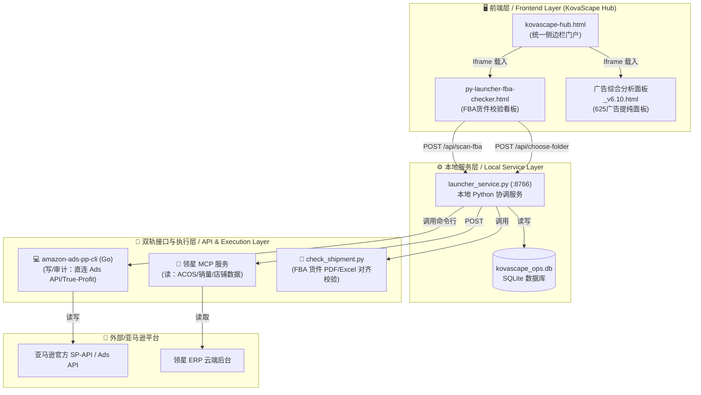

# 🚀 KovaScape AI-Ops 智能运营平台 — 需求与产品设计文档 (RPD)

> **Requirements & Product Design Document**
> 版本: v2.0 | 日期: 2026-07-11 | 状态: 已整合 (新增本地 API 授权、领星 MCP、直连 Ads API 与本地 SQLite 数据库架构)

---

## 1. 项目概述 / Project Overview

### 1.1 项目愿景与定位 (Vision & Positioning)

**[定位] 组级差异化运营增效平台 (二次提纯与短板补齐)**
本项目作为**团队/小组级**的个性化定制平台，与公司级的通用系统进行深度结合：
- **二次提纯 (Refinement)**：对公司级 AI 系统的输出结果（如广告竞价建议）进行二次过滤，注入我们组独有的运营逻辑（如 `625广告分析法`）。
- **短板补齐 (Gap Filling)**：填补公司通用系统未覆盖的特异性痛点（如个性化 FBA 货件多维度对齐校验、IEN 自动回填等）。
- **差异化竞争能力定制 (Differentiation)**：将本组专属的 SOP（如《欧洲站工作SOP》）和成功方法论转化为工具代码。

---

### 1.2 系统集成与数据对接演进

经过近期技术迭代，系统由最初的“纯手动 CSV/Excel 上传”演进为**“双轨混合 API 架构”**：

```
[数据获取 (读)] ──> 领星 MCP (预处理数据，免去大量 Token 与计算延迟)
[安全校验 (审)] ──> 本地 KovaScape Hub (625 决策矩阵 & FBA 货件校验)
[策略执行 (写)] ──> amazon-ads-pp-cli (直连官方 API 执行 Bid 调整/暂停/否词)
[持久化层 (存)] ──> 本地 SQLite 数据库 (OneDrive/坚果云共享，防关联且防数据丢失)
```

---

## 2. 核心系统架构设计 / System Architecture

### 2.1 整体架构图



### 2.2 核心技术决策 (Technical Decisions)

1. **领星 MCP 与官方 API 读写分离**
   - **读（Read-Heavy）**：日常报表、7d/30d ACOS 监控、店铺销量，优先通过 `领星 MCP` 接口获取。避免直接请求亚马逊所带来的高频限流（Throttling）以及重复的 Gzip 报表轮询开销。
   - **写（Write-Heavy）**：竞价修改、否定关键词、暂停广告组合，通过本地 Go 二进制 `amazon-ads-pp-cli` 直连官方 API 瞬间写入，避免 ERP 的同步延迟（通常为 2~8 小时）。
2. **本地微型数据库 SQLite**
   - 本地部署 `kovascape_ops.db`。无需安装 MySQL/PostgreSQL。
   - 该文件可通过**云盘（OneDrive/坚果云）进行组内实时同步**，轻松解决公司与家里电脑的跨端数据对齐。
   - 存储表包含：ASIN -> FNSKU 映射表、历史调优决策日志（防重复改价）、采购 COGS（商品成本）及运费。
3. **安全隔离防关联策略**
   - **API 授权**：在运行 `auth login` 获取 API 凭证时，将生成的 OAuth 登录链接复制到**紫鸟防关联浏览器（安全干净的 IP 环境）**中打开并点击允许。拿到 Token 密匙字符串后，即可在本地电脑放心调用 API，不携带任何浏览器或硬件指纹，100% 杜绝店铺关联风险。
4. **长驻本地边缘服务器**
   - 不在云端服务器部署涉及敏感文件的 Agent（避免云端文件访问不便与 IP 锁拦截）。
   - 在办公室内配置一台不关机的小主机（如 N100 处理器），长驻运行 Launcher 服务作为组内边缘网关，24 小时执行定时审计、数据同步与推送。
5. **多源 RAG 知识库集成 (Multi-source RAG Integration)**
   - 接入团队的非结构化知识资产：包含 Obsidian（本地 Markdown 库）、钉钉知识库（SOP/流程规范）、Tencent ima (个人备忘/笔记)、NotebookLM (深度分析报告)。
   - **Obsidian (本地化)**: 采用本地目录扫描，直接读取本地 `.md` 文件夹（包含排产/出货/推词 SOP），免 API 且极致快速。
   - **钉钉知识库**: 利用现有的 `dws` CLI / `dingtalk-unified` 技能，自动提取群协作文档与企业知识库规章。
   - **Tencent ima / NotebookLM**: 借助 `ima-skills` 与 `notebooklm` MCP 插件，对大型行业报告和 RAG 知识库笔记进行矢量同步与概念搜索，支撑 AI 业务判定。

---

## 3. 升级模块详细设计 / Upgraded Modules

### 📋 模块 1: 店铺全面扫描 — 升级 FBA 货件校验

**已有资产**：[check_shipment.py](file:///d:/Zero%20Tools/AI%E5%B7%A5%E5%85%B7/check_shipment.py), [py-launcher-fba-checker.html](file:///d:/Zero%20Tools/AI%E5%B7%A5%E5%85%B7/py-launcher-fba-checker.html)

#### 升级后数据链路：
- **路径选择**：前端提供“选择文件夹”按钮，点击后发送 POST 请求到本地服务的 `/api/choose-folder` 路由。本地服务调起 Windows 原生 `tkinter.filedialog.askdirectory()` 对话框，由运营人员点选目标出货目录。
- **扫描校验**：Python 服务自动解包目录下的所有货件 ZIP 包，运行 `check_shipment.py`。
  1. 对齐采购 Excel 装箱单、亚马逊后台 CSV 与外箱贴标 PDF（总箱数与商品数）。
  2. 针对 CA/JP/UK/DE 等超重敏感站点，单箱超过 15KG 时，强制校验包内是否已含有 `超重标签.pdf`；缺失则红字拦截警告。
  3. 针对欧洲站点（DE/FR/IT/ES/UK等），强制核对是否存在 GPSR 安全标签 PDF 文件。
- **结果呈递**：本地服务以微服务 JSON 格式返回给前端，以 Bento 极简卡片直接渲染。卡片包含一键「打开报告」（调用 `/open-file?path=...`，使用正斜杠 `/` 规避 Javascript 转义错误）和「打开所在目录」，自动唤起本地默认的 Markdown 编辑器和资源管理器。

---

### 📊 模块 6: 广告分析审计与提纯 — 升级 625 智能调控

**已有资产**：[广告综合分析面板_v6.10.html](file:///d:/Zero%20Tools/AI%E5%B7%A5%E5%85%B7/%E5%B9%BF%E5%91%8A%E7%BB%BC%E5%90%88%E5%88%86%E6%9E%90%E9%9D%A2%E6%9D%BF_v6.10.html), `amazon-ads-pp-cli` (v2026.7.1)

#### 升级后决策流设计：
```
[领星 MCP] ──拉取近7天数据──> [625 审计面板] ──评估 TACOS / 广告占比 / 自然排名
                                   │
                                   ├──> [局部高 ACOS / 整体 TACOS 正常] ──> 🟢 保持曝光 (仅否定高点击无转化词)
                                   ├──> [高流量低转化 / 单词 ACOS = ∞]  ──> 🔴 自动否定 (调用 Ads API 写入)
                                   └──> [广告占比过高 / TACOS 偏高]     ──> 🟡 每次调低竞价 5%-10% (分时出价)
```

- **TACOS 优先决策**：AI 在判定是否调整广告竞价前，必须先利用 `acos-vs-tacos` 命令将广告数据与本地 SQLite 数据库中的商品真实总销售额对齐。只有在 TACOS（总广告花费比）超标且广告依赖度高的情况下，才触发调价机制。
- **防止一刀切**：禁止直接硬性切断正在推主词排名的广告组合。结合 `true-profit` 命令测算出剔除广告、FBA 费用和 COGS 后的真实 Listing 净利润线，确保调优策略符合“利润最优化”而不是单纯的“ACOS 最低化”。
- **API 瞬间同步**：通过 CLI 命令行工具，运营确认决策后可一键在 Hub 页面将指令直接回写亚马逊，彻底解决 ERP 只能读不能写的短板。

---

## 4. 里程碑与下阶段实施计划

1. **Milestone 1**: 跑通本地 `amazon-ads-pp-cli` 的 `auth login`（预计 W1 W2，需运营在紫鸟浏览器中协助授权）。
2. **Milestone 2**: 创建本地 SQLite `kovascape_ops.db`，建立商品 COGS 表与 ASIN 映射表，并将其加入坚果云/OneDrive 同步监控。
3. **Milestone 3**: 在 `launcher_service.py` 中对接 `acos-vs-tacos` 命令行，开发 625 面板的“一键调价/否词”按钮。

---

> **文档状态**: 🟢 已整合优化。
> **下一步建议**: 请根据文中的授权指导，在本地终端执行 `amazon-ads-pp-cli auth login` 激活最后一步凭证。
