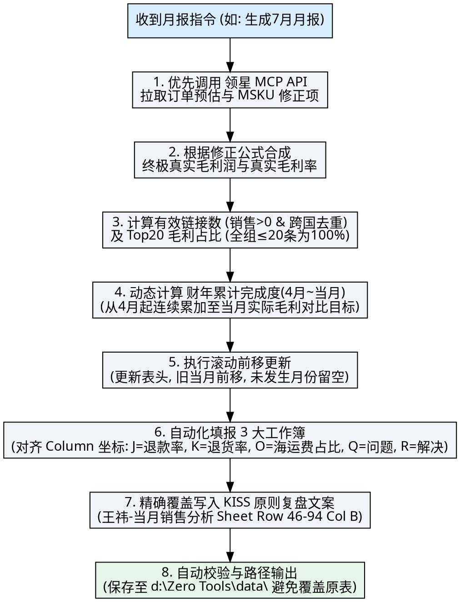

# 领星 ERP 运营月复盘全自动化工作流 (KovaScape 专属版)

## Overview

本 Skill 规范了南京欧洲组（KS 品牌）亚马逊店铺运营月度复盘数据的全自动拉取、聚合、校验与 3 大目标汇报表格的全 Sheet 自动化填报、终极真实毛利结算与滚动更新流程。

---

## When to Use

- 当用户需要生成、拉取、填报或更新**领星 ERP 运营月复盘**、**运营主管月复盘**或**当月销售分析**时。
- 触发关键词：`月报`、`月度复盘`、`主管月复盘`、`当月销售分析`、`生成 6 月月报`、`滚动月度数据`、`领星月报`。

---

## Quick Reference (快速参考表)

| 视角/维度 | 权威数据源 & MCP 工具 | 核心指标 & 适用规则 |
| :--- | :--- | :--- |
| **店铺边界** | `get_my_sids` | **严格限定「南京欧洲组KS」** (SIDs: 5018-5031, 5751)，忽略其他无关组。 |
| **1. 订单预估利润** | `query_product_performance_asin_lists` (下单视角 `date_type="purchase"`) | ASIN级销售额、销量、广告费与预估订单利润。 |
| **2. 差额修正项** | `get_profit_report_msku` (结算视角 `date_type="settlement"`) | 提取仓储费、赔偿金、FBA移除弃置、盘亏盘盈等调整数据。 |
| **3. 终极真实毛利** | **核心公式合成** | `终极真实毛利 = 订单预估利润 + 仓储差异 + 杂费对冲 + 盘库调整` (详见下文)。 |
| **有效链接去重** | `E:\#工作资料\备货计划\新品下单文件_*.xlsx` | 按负责人 + 父 ASIN 且**当月销售额 > 0**；多个国家同一产品只算 1 条链接。 |
| **FBA 清货存量** | `FBA库存情况` Sheet | 91-180天目标=实际\*0.8；181-270天目标=实际\*0.5；271天以上目标=实际\*0.3。 |

---

## 终极真实毛利核算步骤与公式

为保证产品表现层面的“预估利润”与公司“结算利润”100%拉齐，必须执行三步法合成计算：

### 1. 提取基础订单预估利润
从 `query_product_performance_asin_lists` 汇总得到基础数据：
$$\text{订单预估利润} = \text{销售额} - \text{平台佣金} - \text{FBA配送费} - \text{预估采购成本} - \text{预估头程成本} - \text{广告花费}$$

### 2. 从 MSKU 利润表提取修正细项
调用 `get_profit_report_msku` 抓取对应的实际财务账单修正项：
- **仓储差异** = $\text{fbaStorageFeeAccrual} (\text{预扣仓储}) - \text{fbaStorageFee} (\text{实际仓储})$
- **杂费对冲** = $\text{reimbursements} (\text{库存赔偿}) + \text{platformFee} (\text{实际平台调整}) - \text{others} (\text{其他退回对冲})$
- **盘库调整** = $\text{cgPriceTotal} (\text{盘点出入库采购}) + \text{cgTransportCostsTotal} (\text{盘点出入库物流}) - \text{sharedFbaRemovalFee} (\text{移除货损})$

### 3. 合成最终指标
$$\text{终极真实毛利} = \text{订单预估利润} + \text{仓储差异} + \text{杂费对冲} + \text{盘库调整}$$
$$\text{真实毛利率} = \text{终极真实毛利} / \text{销售额}$$

---

## Core Workflow (核心执行步骤)



---

## 3 大目标汇报文件与 Sheet 坐标规约

### 1. 《2026财年运营月复盘---运营六组 王祎-YYYYMM.xlsx》
- **`全年完成总表`**：Col E Row 4 (实际销售额)，Col E Row 8 (实际毛利额)。
- **`月度产品分析表`**：Col K (11) 为**月产品成本占比 (采购成本/销售额)**，必须赋值浮点数并应用 `0.0%` 百分比格式！
- **`总产品` Sheet 列坐标规约**：
  - Col E (5): `评分/评论数` (如 `4.4/55`)
  - Col F (6): `月销量` | Col G (7): `月销售额` | Col H (8): `月利润率` | Col I (9): `月毛利润`
  - Col J (10): `月退款率` | **Col K (11): `月退货率`** (数值，如 `0.034`)
  - Col L (12): `月广告费占比` | Col M (13): `月仓储费占比` | Col N (14): `月产品成本占比`
  - **Col O (15): `月海运费占比`** (如 `0.0515`) | **Col P (16): `月库销比`** (如 `11.0`)
  - **Col Q (17): `运营中问题总结`** (写入【异常诊断点】)
  - **Col R (18): `解决办法`** (写入【优化解决措施】)

### 2. 《2026年M月运营主管月复盘- 王祎.xlsx》
- **`链接数量汇总`**：填报有效链接数（化一博 8，王祎 5，全组 13），Top20 占比（100.0%）。**其他运营组保持留空**。
- **`月度销售数据`**：填报当月目标/实际销售额与毛利润；Col V-AA 填报 **财年累计完成情况（4月至当月累加）**。**原生 Row 17-21 备注切勿覆盖**。
- **`工厂端库存`**：**全表保持留空**。

### 3. 《王祎-当月销售分析-YYYYMM.xlsx》
- **`王祎-当月销售分析` Sheet**：
  - 保留 Row 1 ~ Row 45 原生核心指标与公式。
  - **清空未发生的未来月份**：将尚未到来的未来月份实际销售额与毛利率清空 (`None`)。
  - **KISS 原则精细覆盖**：将包含 Keep / Improve / Stop / Start(含 1-2 分钟 AI 提效介绍) 的精制复盘段落，覆盖写入 **Row 46 ~ Row 94 Col B (合并单元格 B47:B94)**，切勿掩盖上文核心指标。

---

## 财年累计与滚动更新规范 (Fiscal Year-to-Date & Rolling Rules)

1. **财年累计公式 (FYTD Cumulative Profit)**：
   - 财年周期为 **4月 至 次年 3 月**。
   - 累加范围：`sum(4月实际订单毛利 ... 当月实际订单毛利)` vs `sum(4月目标毛利 ... 当月目标毛利)`。
2. **表头与数据前移**：每月制作新月报时，自动将上月表头与数据推移至“前一个月”，最新月份数据写入“当月”。
3. **新增产品 100% 自动检查机制**：7 月及未来月报执行时，必须自动扫描校验产品表里所有**新增/新上架 ASIN 的数据完整性**，确保零遗漏。

---

## Common Red Flags & Mistakes (避坑指南)

- ❌ **严禁固定为 Q1/3个月累加**：财年累计完成度必须按**4月至当前月**动态连续累加。
- ❌ **严禁直接使用订单预估利润代替真实毛利**：必须拉取 MSKU 利润表中的仓储差异、杂费对冲和盘库调整进行差额扣减后，再填入毛利额中。
- ❌ **严禁混淆 Col K 与 Col Q/R**：退货率数值在 Col K (11列)，诊断问题在 Col Q (17列)，解决办法在 Col R (18列)。
- ❌ **严禁使用 MergedCell 赋值报错**：赋值前需使用 `isinstance(cell, Cell)` 检查，防止合并单元格引发 AttributeError。
- ❌ **严禁把未来月份错填为历史数据**：未到来的月份实际值必须填 `None` 留空。

---

## Implementation (一键执行脚本)

```bash
# 运行月复盘全自动化主控脚本
python src/fill_all_sheets_master.py --month=202606
```
