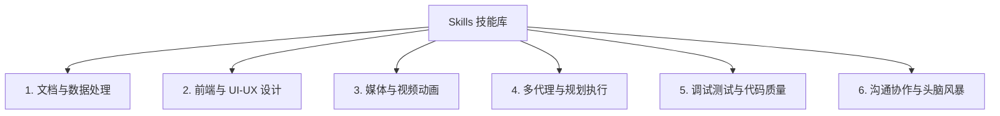

# Zero Tools 项目技能库（Skills）分类及使用说明文档
# Zero Tools Project Skills Classification & Usage Guide

在本项目中，集成了丰富的本地与全局**技能（Skills）**。这些技能为 AI 助手（如 Antigravity / Claude）提供了处理特定任务时的专业指令、代码脚本和规范工作流。

为了方便您在公司电脑或日常开发中高效调用，本文档对所有 Skill 进行了分类，并给出了具体的使用场景与调用方法。

---

## 🚀 核心：AI 技能的触发机制

AI 助手主要通过以下三种方式识别并加载这些技能：
1. **快捷斜杠命令（Slash Commands）**：在聊天框中直接输入如 `/pdf` 或 `/ui` 等命令，AI 会自动加载对应的 `SKILL.md` 工作流。
2. **关键词触发**：在日常交流中提到特定任务词（例如：“帮我做个PPT”、“调试这个Bug”），AI 会根据 `SKILL.md` 中定义的元数据描述匹配加载。
3. **主动调用**：您也可以直接指引 AI：“使用 `docx` 技能库中的脚本处理这个文档”。

---

## 📂 技能（Skills）大类划分

根据功能与应用场景，我们将 38 个技能分为以下 **6 大类**：

---

## 🛠 各类别技能详细说明

### 1. 文档与数据处理类 (Document & Data Processing)
用于解析、编辑和生成常见的办公文档，尤其适用于处理亚马逊日常运营中的各类数据报表。

| 技能名称 | 目录路径 | 核心作用与使用场景 | 触发方式/关键词 |
| :--- | :--- | :--- | :--- |
| **`docx`** | `skills/docx` | 读写 Word 文档，支持处理复杂的 OOXML 结构、添加注释和样式。 | `Word`, `docx`, `修改文档` |
| **`pptx`** | `skills/pptx` | PPT 幻灯片自动化修改，如文字替换、页序重排、生成缩略图。 | `PPT`, `幻灯片`, `pptx` |
| **`xlsx`** | `skills/xlsx` | 处理 Excel 表格，重新计算公式。常用于亚马逊广告及运营数据处理。 | `/xlsx`, `Excel`, `表格`, `xlsx` |
| **`pdf`** | `skills/pdf` | 解析、编辑或从 PDF 中提取表单字段，转换页面为图片进行视觉检查。 | `/pdf`, `PDF`, `表单填充` |
| **`KovaScape Report Design`** | `skills/KovaScape Report Design` | 报告排版风格定制，生成符合 Kova 规范的设计。 | `报告排版`, `Report Design` |

---

### 2. 前端与 UI-UX 设计类 (Frontend & UI-UX Design)
用于设计高颜值、现代感且响应迅速的工具界面和前端页面。

| 技能名称 | 目录路径 | 核心作用与使用场景 | 触发方式/关键词 |
| :--- | :--- | :--- | :--- |
| **`ui-ux-pro-max`** | `skills/ui-ux-pro-max` | **旗舰 UI 设计规范**。指导设计系统建立、色彩挑选及交互设计。 | `/ui`, `设计UI`, `美化界面` |
| **`frontend-design`** | `skills/frontend-design` | 前端组件布局，遵循响应式和极简现代美学。 | `前端设计`, `Responsive` |
| **`theme-factory`** | `skills/theme-factory` | 快速生成和应用各种暗黑/亮色系 UI 配色方案（如午夜银河、极地霜冻）。 | `配色方案`, `UI主题` |
| **`canvas-design`** | `skills/canvas-design` | Canvas 画布渲染与图形设计规约。 | `Canvas`, `画布渲染` |
| **`brand-guidelines`** | `skills/brand-guidelines` | 遵循品牌视觉指南进行 UI 设计。 | `品牌视觉`, `Brand` |
| **`algorithmic-art`** | `skills/algorithmic-art` | 运用算法和 JS 生成动感艺术图形作为 UI 背景。 | `算法美术`, `背景动效` |
| **`web-artifacts-builder`** | `skills/web-artifacts-builder` | 自动打包和构建 Web 预览产物。 | `打包Web`, `Build Artifact` |

---

### 3. 媒体与视频动画类 (Media & Video Animation)
用于批量化自动生产短视频和 GIF 动图，常用于亚马逊商品主页视频生成或社交媒体动效。

| 技能名称 | 目录路径 | 核心作用与使用场景 | 触发方式/关键词 |
| :--- | :--- | :--- | :--- |
| **`remotion`** | `skills/remotion` | 使用 React/JS 编写和渲染动画视频，支持导入 SRT 字幕和 Lottie 动画。 | `Remotion`, `视频渲染` |
| **`remotion-best-practices`** | `skills/remotion-best-practices` | Remotion 最佳实践规范（音频裁剪、图表动效等）。 | `视频剪辑`, `Video Layout` |
| **`slack-gif-creator`** | `skills/slack-gif-creator` | 使用 Python `pillow` 库配合缓动函数（Easing）批量合成高帧率 GIF 动图。 | `制作GIF`, `动图生成` |

---

### 4. 多代理与规划执行类 (Multi-Agent & Planning)
在处理复杂或耗时较长的大型项目时，AI 辅助梳理逻辑并拆分执行的流程技能。

| 技能名称 | 目录路径 | 核心作用与使用场景 | 触发方式/关键词 |
| :--- | :--- | :--- | :--- |
| **`using-superpowers`** | `skills/using-superpowers` | **Superpowers 核心工作流**。用于深度头脑风暴、指定大纲与分布执行。 | `/superpower`, `复杂任务` |
| **`writing-plans`** | `skills/writing-plans` | 撰写清晰、严谨的 `implementation_plan.md` 实施方案。 | `制定方案`, `写计划` |
| **`executing-plans`** | `skills/executing-plans` | 在用户审批计划后，按步骤稳健执行，保持任务状态追踪。 | `执行任务`, `Task Progress` |
| **`subagent-driven-development`** | `skills/subagent-driven-development` | 派生子代理（Subagent）并行处理研究和开发，提升大体量开发效率。 | `子代理`, `Subagent` |
| **`dispatching-parallel-agents`** | `skills/dispatching-parallel-agents` | 并行分发和调度多个 AI 独立模块。 | `并行任务`, `Parallel` |
| **`verification-before-completion`** | `skills/verification-before-completion` | 在完成开发前执行严格的三步校验法（静态分析、编译测试、功能核对）。 | `开发完结校验`, `Verify` |
| **`finishing-a-development-branch`** | `skills/finishing-a-development-branch` | 规范开发分支合并、代码清理和最终的 Walkthrough 文档更新。 | `分支清理`, `Finish Branch` |

---

### 5. 调试测试与代码质量类 (Debugging & Testing Quality)
保证代码安全稳定、寻找 Bug 和提高多端交互测试效率的技能。

| 技能名称 | 目录路径 | 核心作用与使用场景 | 触发方式/关键词 |
| :--- | :--- | :--- | :--- |
| **`systematic-debugging`** | `skills/systematic-debugging` | 系统化调试（根因分析、查找污染源脚本、多层防御体系设计）。 | `Debug`, `找Bug`, `报错调试` |
| **`webapp-testing`** | `skills/webapp-testing` | 对编写的 WebApp 网页工具进行端到端自动化测试或元素检测。 | `/test`, `自动化测试` |
| **`test-driven-development`** | `skills/test-driven-development` | 测试驱动开发（TDD）规范，避免测试反模式。 | `TDD`, `写测试` |
| **`karpathy-guidelines`** | 全局 (或 `skills/karpathy-guidelines`) | **Karpathy 编码准则**（避免过度设计、渐进式外科手术式修改等最佳实践）。 | `Karpathy`, `编码规范` |
| **`requesting-code-review`** | `skills/requesting-code-review` | 自动发起并整理规范的代码提审信息。 | `代码提审`, `PR Review` |
| **`receiving-code-review`** | `skills/receiving-code-review` | 处理和吸收来自 Review 的意见并修改。 | `修改意见`, `Merge Review` |
| **`mcp-builder`** | `skills/mcp-builder` | 构建新的自定义 MCP 服务，包含 Node/Python 模板与标准协议集成。 | `开发MCP`, `MCP Builder` |
| **`skill-creator`** | `skills/skill-creator` | 用于让 AI 给自身开发并打包发布新 Skill 的工具。 | `创建新技能`, `Skill Creator` |
| **`caveman`** | `.agents/skills/caveman` | **野人模式**。极致压缩输出文本以节省 API 费用与 Token 消耗，支持多语言野人/文言文风格。 | `/caveman`, `野人模式`, `wenyan`, `less tokens` |

---

### 6. 沟通协作与头脑风暴类 (Communication & Brainstorming)
在设计模糊、不明确时用于与用户达成共识或快速沟通的软技能。

| 技能名称 | 目录路径 | 核心作用与使用场景 | 触发方式/关键词 |
| :--- | :--- | :--- | :--- |
| **`grill-me`** | `skills/grill-me` | **反思式拷问工作流**。在方案设计初期，AI 会毫不留情地连续提问以解决设计盲区。 | `/grill-me`, `grill me`, `拷问计划` |
| **`brainstorming`** | `skills/brainstorming` | 针对特定运营或开发痛点进行发散性头脑风暴。 | `头脑风暴`, `Brainstorm` |
| **`doc-coauthoring`** | `skills/doc-coauthoring` | 与用户协同撰写高质量的文档。 | `协同编写`, `Coauthor` |
| **`internal-comms`** | `skills/internal-comms` | 编写优雅的周报、企业简报、FAQ 说明信等。 | `周报`, `企业沟通` |

---

## 💡 日常使用小贴士

1. **在新电脑上如何注册它们？**
   - 项目内的 `skills` 是**局部技能**，脚本 `setup.ps1` 会自动在本地初始化其关联路径。
   - 如果您在新电脑上创建了新项目，可以命令 AI 自动将原项目的局部技能拷贝过去。
2. **同类技能（Skills）会冲突吗？**
   - **会有轻微覆盖**。如果两个技能制定的规则冲突（例如一个要求详尽解释，另一个要求极简），后加载的技能规则会覆盖先加载的。如果规则互补，则它们会和谐共存。
3. **调用的优先级是怎样的？**
   - 规则层级：本地规则（如 `.agents/AGENTS.md`） ➡️ 本地技能（`.agents/skills/`） ➡️ 全局配置（`~/.gemini/`）。
   - 唤醒机制：显式指令（如斜杠命令 `/pdf`）优先于隐式关键词匹配。
4. **如何同时触发多个技能？**
   - 在您的 Prompt（提示词）中**同时要求或明示加载**。
   - 例如说：“**请结合 `ui-ux-pro-max` 规范与 `frontend-design` 技能**来帮我设计和实现这个网页工具。” 这样 AI 就会同时载入并遵循这两套技能逻辑。
5. **自定义修改**：
   - 每一个 `skills/<名称>/SKILL.md` 都是由清晰的 YAML 头信息和 Markdown 步骤构成的，您可以随时让 AI 编辑里面的 `SKILL.md`。
